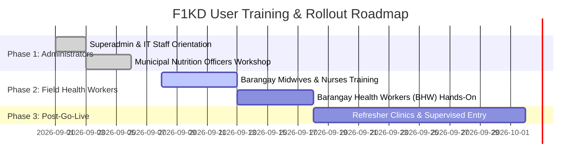

# First 1,000 Days (F1KD) Information System
## Full User Manual, Training & Support Guide

> **Document Code:** F1KD-MAN-2026-V1  
> **Section Reference:** Section 4.2.11 - Training & Support  
> **Target Audience:** Superadmins, Municipal Nutrition Action Officers, Community Organizers, Rural Health Midwives, and Barangay Health Workers (BHWs)  
> **System Version:** v1.0.0 (Express.js REST API / React Single-Page Application / MySQL)  
> **Effective Date:** 2026-09-14  

---

## Table of Contents
1. [System Overview & Objectives](#1-system-overview--objectives)
2. [Getting Started & User Authentication](#2-getting-started--user-authentication)
3. [User Roles & Security Permissions Matrix](#3-user-roles--security-permissions-matrix)
4. [Step-by-Step Module User Manual](#4-step-by-step-module-user-manual)
   - [4.1 Navigation & Dashboard](#41-navigation--dashboard)
   - [4.2 Community & School Cluster Management](#42-community--school-cluster-management)
   - [4.3 Beneficiary Enrollment & Profile Management (Mothers & Children)](#43-beneficiary-enrollment--profile-management-mothers--children)
   - [4.4 Clinical Health Monitoring & Checkup Steppers](#44-clinical-health-monitoring--checkup-steppers)
   - [4.5 Supplementary Feeding Programs & Attendance Logs](#45-supplementary-feeding-programs--attendance-logs)
   - [4.6 Progress Reports & Data Exporting](#46-progress-reports--data-exporting)
   - [4.7 User Account Management & School Assignment (Superadmin Only)](#47-user-account-management--school-assignment-superadmin-only)
5. [Troubleshooting & Frequently Asked Questions (FAQs)](#5-troubleshooting--frequently-asked-questions-faqs)
6. [Training Delivery Plan & User Adoption Strategy](#6-training-delivery-plan--user-adoption-strategy)
7. [Technical Support & Helpdesk Escalation Matrix](#7-technical-support--helpdesk-escalation-matrix)

---

## 1. System Overview & Objectives

The **First 1,000 Days (F1KD)** Information System is a specialized maternal and child health monitoring web platform. The First 1,000 Days refers to the critical window of biological development spanning from **conception (Day 0) to a child's second birthday (Day 1,000)**. Nutritional or health deficiencies during this timeframe lead to irreversible cognitive stunting and physical developmental delays.

### Primary Objectives:
* **Track Maternal Health:** Monitor pregnant mothers through all three trimesters, ensuring prenatal checkups, laboratory financial assistance, dental care, tetanus toxoid vaccinations, and milk supplementation.
* **Track Pediatric Growth:** Monitor infants from delivery through 48 weeks of age, recording vital anthropometrics (weight, length, head circumference), exclusive breastfeeding compliance, and childhood immunizations.
* **Coordinate Interventions:** Facilitate supplementary feeding programs and community-level mother support groups across designated school catchment areas and barangay clusters.
* **Data-Driven Decision Making:** Supply municipal nutritionists and public health officers with real-time progress indicators, high-risk pregnancy alerts, and exportable statistical reports.

---

## 2. Getting Started & User Authentication

### 2.1 System Access Requirements
1. **Supported Browsers:** Google Chrome (recommended), Microsoft Edge, Mozilla Firefox, or Safari (latest versions).
2. **Access Links:**
   * **Production:** `https://f1kd-system.org`
   * **Staging / UAT:** `https://uat.f1kd-system.org`
   * **Local Test / Training:** `http://localhost:5173`

### 2.2 Login Procedure
1. Open your web browser and navigate to the system URL.
2. On the **Login** screen, enter your registered work **Email Address** and **Password**.
3. Click the **Log In** button.
4. Upon successful credential validation, an encrypted JSON Web Token (JWT) is issued to your session, and you are automatically redirected to the system **Dashboard** or **Community** overview page.

```
+-------------------------------------------------------------+
|                     F1KD LOGIN PORTAL                       |
|                                                             |
|   Email:      [ user@f1kd-system.org                      ] |
|   Password:   [ *****************                         ] |
|                                                             |
|               [       LOG IN       ]                        |
|                                                             |
|   Default Test Credentials:                                 |
|   Superadmin:  Superadmin@gmail.com   / Welcome123!         |
|   Admin:       Admin@gmail.com        / Welcome123!         |
|   Healthworker:Healthworker@gmail.com / Welcome123!         |
+-------------------------------------------------------------+
```

### 2.3 Password Management & Logout
* **Logging Out:** Click on your profile avatar/name located in the top-right corner of the topbar and click **Logout**. Your session token will be invalidated.
* **Password Resets:** If you forget your password, contact your assigned System Superadmin to generate and issue a secure temporary password.

---

## 3. User Roles & Security Permissions Matrix

The F1KD application enforces strict Role-Based Access Control (RBAC) with operational school-level data scoping:

| Role Title | System Role Key | Assigned Scope | Module Permissions |
| :--- | :--- | :--- | :--- |
| **Superadmin** | `super_admin` | Global (All Schools & Municipalities) | Full unrestricted read, create, update, and delete privileges across all modules, including system-wide User Management. |
| **Administrator** | `admin` | Global / Municipal Level | Management of programs, community batches, progress report generation, and supervisor oversight. |
| **Partner / Community Organizer** | `partner` (scoped) | Assigned School / Barangay Cluster | Managing mother support groups, beneficiary profiles, scheduling cohort batches within their assigned community. |
| **Health Worker (BHW / Midwife)** | `partner` (scoped) | Assigned Clinic / Barangay Health Station | Logging clinical checkups, prenatal vitals, growth measurements, vaccine doses, and feeding program attendance. |

> **IMPORTANT:** Users with scoped operational roles (`admin`, `partner`, `health worker`) must have a valid `school_id` assigned by the Superadmin. Attempting to modify records outside your assigned school will trigger an authorization error (`This account is not assigned to a school`).

---

## 4. Step-by-Step Module User Manual

### 4.1 Navigation & Dashboard
* **Sidebar Menu:** The left-hand navigation panel gives you one-click access to all modules:
  * 📊 **Dashboard:** High-level statistical summaries, trimester counts, high-risk beneficiary totals, and recent activity cards.
  * 🏫 **Community:** Organizational hierarchy of schools, communities, cohorts, and mother groups.
  * 👩‍👧 **Beneficiaries:** Searchable master directory of registered mothers and children.
  * 🩺 **Monitoring:** Clinical check-up workflows, vital signs recording, and developmental milestone tracking.
  * 📦 **Programs:** Supplementary feeding and intervention program tracking.
  * 📈 **Progress Report:** Comprehensive analytical data tables with advanced multi-parameter filtering.
  * ⚙️ **User Management:** *(Superadmin Only)* Creation, configuration, and auditing of staff accounts.
* **Topbar:** Contains the breadcrumb trail, school filter indicators, and the user profile dropdown.

---

### 4.2 Community & School Cluster Management
The F1KD system models geographic hierarchy as: **Community / School -> Batches (Cohorts) -> Support Groups**.

1. **Viewing Communities:**
   * Click **Community** on the sidebar.
   * View the listing of barangays/schools, their total registered records, and completion progress percentages.
2. **Drilldown by School / Batch / Group:**
   * Click on any school card to filter beneficiaries enrolled under that school.
   * Switch between the **Batches** tab (cohorts organized by enrollment year/season) and the **Groups** tab (smaller peer-support clusters led by community leaders).
3. **Connecting Groups to Batches:**
   * When creating a batch, select the associated support groups to establish group-batch associations for consolidated monitoring.

---

### 4.3 Beneficiary Enrollment & Profile Management (Mothers & Children)

#### A. Registering a New Mother (Prenatal Enrollment)
1. Navigate to **Beneficiaries** and click **+ Add Mother** (or navigate to `/beneficiary/create/mother`).
2. Fill out the multi-step intake wizard:
   * **Personal Information:** First Name, Middle Name, Last Name, Suffix, Date of Birth, Contact Number, Physical Address.
   * **Community Association:** Select the assigned Community/School, Batch, and Support Group.
   * **Obstetric Baseline:** Last Menstrual Period (LMP), Estimated Due Date (EDD), Gravida (total pregnancies), Para (viable deliveries), Abortions, Stillbirths, and High-Risk Flag.
   * **Emergency Contacts:** Spouse Name, Emergency Contact Person, Relationship, and Phone Number.
   * **Medical History:** Pre-existing conditions (Hypertension, Diabetes, Asthma, Cardiac issues) stored as structured flags.
   * **Document Uploads:** Attach scanned digital copies of the Mother's Birth Certificate and Signed Informed Consent Document (PDF, PNG, or JPEG format).
3. Click **Save Beneficiary**. The system generates a unique **`mother_code`** (e.g., `MOTH-0024`).

#### B. Registering an Infant / Child
1. Navigate to the Mother's Profile page and click **+ Register Child** (or select **+ Add Child** from Beneficiaries).
2. Complete the infant intake form:
   * **Demographics:** First Name, Middle Name, Last Name, Gender, Birth Date, and Birth Order (`no_of_child_delivered`).
   * **Birth Measurements:** Birth Weight (kg), Birth Length (cm), APGAR Score (1 & 5 min), Head Circumference.
   * **Delivery Information:** Mode of Delivery (Normal Spontaneous vs. C-Section), Place of Birth (Hospital, RHU, Home), Attendant (Doctor, Midwife, Nurse).
   * **Newborn Screening:** Expanded Newborn Screening (ENBS) panel status and laboratory findings.
   * **Nutrition Baseline:** Initial feeding type (Exclusive Breastfeeding, Formula, Mixed).
   * **Document Attachment:** Upload scanned copy of Child's Birth Certificate / Certificate of Live Birth.
3. Click **Submit**. The system issues an official **`child_code`** (e.g., `CHLD-0042`) and links the record to the biological mother.

---

### 4.4 Clinical Health Monitoring & Checkup Steppers

#### A. Maternal Checkup Workflow (Trimesters 1, 2, and 3)
1. Navigate to **Monitoring** and select the target maternal beneficiary.
2. Select the current **Trimester** tab:
   * **1st Trimester:** Checkups 1 & 2 (Baseline gestational confirmation & early ultrasound).
   * **2nd Trimester:** Checkups 3 & 4 (Mid-pregnancy anatomy & fundal height progression).
   * **3rd Trimester:** Checkups 5 to 8 (Late pregnancy vitals, fetal heart rate, and delivery preparation).
3. Record clinical vital signs:
   * **Date of Visit & Gestational Age (weeks)**
   * **Blood Pressure (mmHg)** (e.g., `110/70`)
   * **Weight (kg) & Height (cm):** The system automatically calculates and displays the **Body Mass Index (BMI)** and Nutritional Status.
   * **Fundal Height (cm) & Fetal Heart Rate (bpm)**
   * **Referral Flags:** Toggle *Referred to Hospital* if complications or pre-eclampsia signs are detected.
   * **Laboratory Assistance:** Check if financial/diagnostic subsidy was disbursed, enter the voucher amount, and source of funds.
   * **Milk Subsidy Distribution:** Record the date and quantity (pcs) of maternal formula milk provided.
4. Click **Save Checkup**. The maternal milestone progress percentage automatically increments.

#### B. Child Growth & Immunization Monitoring (Weeks 1 to 48)
1. Select the child beneficiary under the **Monitoring** module.
2. The interactive growth stepper displays the **48-Week Monitoring Timeline**:
   * **Anthropometrics:** Enter Weight (kg), Height (cm), and Head Circumference (cm) recorded on clinic stadiometers and scales.
   * **Milestone Assessment:** Evaluate Developmental Status (*Age-Appropriate*, *Mild Delay*, *Advanced*).
   * **Vaccinations Administered:** Mark childhood immunization milestones (BCG, Hepatitis B birth dose, Pentavalent 1-3, Oral Polio 1-3, Inactivated Polio, Pneumococcal Conjugate PCV 1-3, and MMR 1-2).
   * **Clinical Remarks & Next Appointment:** Enter pediatrician/midwife observations and set the next return date.
3. Click **Save Pediatric Record**. Growth metrics are plotted onto the child's longitudinal growth curve.

---

### 4.5 Supplementary Feeding Programs & Attendance Logs
1. Navigate to **Programs** on the sidebar.
2. **Creating an Intervention Program:** Click **+ New Program**, enter the Program Title (e.g., *DepEd/LGU First 1,000 Days Milk & Hot Meal Feeding*), Provider agency, Target Beneficiary Cohort (Mothers, Children, or Combined), Target Quota, and Timeline.
3. **Allocating Clusters:** Define target beneficiary numbers across specific school or barangay clusters.
4. **Daily Attendance & Receipt Logging:**
   * Select the active program session.
   * Open the beneficiary attendance roster.
   * Click **Check In / Received** next to the beneficiary's name to verify distribution of rations/meals.
   * The system logs the date, recording health worker ID, and updates the cluster completion percentage in real time.
5. **Receipt History:** Click **Receipt History** on any beneficiary profile to inspect their lifetime calendar of received program commodities.

---

### 4.6 Progress Reports & Data Exporting
1. Navigate to **Progress Report** on the sidebar.
2. **Filtering Parameters:**
   * Filter by **Entity Scope:** Mothers, Children, or Combined.
   * Filter by **Community / School:** Filter by specific school cluster or view all.
   * Filter by **Status:** Active, Completed, High-Risk, or Pending.
   * Filter by **Trimester / Week Number:** Focus on specific clinical monitoring checkpoints.
3. **Customizing Columns:** Toggle column visibility using the column registry selector to show only relevant clinical or demographic fields.
4. **Exporting Data:**
   * Click **Export CSV / Excel:** Downloads a clean, spreadsheet-ready CSV file formatted for Microsoft Excel, SPSS, or Google Sheets.
   * Click **Print / PDF:** Launches browser print formatting optimized for A4/Letter size executive reports.

---

### 4.7 User Account Management & School Assignment (Superadmin Only)
1. Navigate to **User Management** (accessible only when authenticated as a `super_admin`).
2. **Adding a New Staff Account:**
   * Click **+ Add User**.
   * Fill in First Name, Last Name, Middle Initial, Email Address, Contact Number, and Gender.
   * **Assign Role:** Select `Admin`, `Partner`, `Community Organizer`, or `Health Worker`.
   * **Assign School / Community:** Select the school/barangay cluster this staff member is authorized to manage.
   * **Password Configuration:** Click **Generate Password** to create an 8-character cryptographically secure default password, or copy the generated password to distribute to the staff member.
3. Click **Create User**.
4. **Account Maintenance:** Click on any user row to view their detail page (`/user-management/user/:id`). Superadmins can update contact details, change assigned schools, reset passwords, or toggle account status between **Active** and **Suspended**.

---

## 5. Troubleshooting & Frequently Asked Questions (FAQs)

### Q1: I get an error "Invalid credentials" when logging in.
* **Resolution:** Ensure your email is typed correctly (case-insensitive) and verify Caps Lock is off. If you are using pre-seeded accounts, test with default credentials (`Welcome123!`). If problems persist, contact your Superadmin to verify that your account status is set to `Active` and not `Suspended`.

### Q2: I see "Permission Denied: This account is not assigned to a school".
* **Resolution:** Your user account has an operational role (`partner`, `health worker`, or `admin`) that requires a geographic school assignment to enforce data isolation. Have your Superadmin navigate to **User Management**, open your account, select your assigned school from the dropdown, and save changes.

### Q3: Why is the "Save Checkup" button disabled or failing?
* **Resolution:** Verify that all mandatory clinical fields are filled out: Trimester, Checkup Number, and Visit Date. Ensure that vital numbers are valid (e.g., Weight and Height must be positive decimal numbers).

### Q4: Can I upload photos of documents from a mobile phone?
* **Resolution:** Yes. The file uploader supports standard image formats (`.jpg`, `.jpeg`, `.png`) as well as `.pdf`. Ensure image files are well-lit, sharp, and under 10 MB in file size.

### Q5: What happens if a mother has twins or triplets?
* **Resolution:** In the Mother's Profile, multiple birth scenarios are fully supported. Simply click **+ Register Child** once for each infant. When prompted, specify the Multiple Birth Type (*Twin*, *Triplet*) and set the birth delivery order (`no_of_child_delivered`). Both children will independently link to the same mother record.

---

## 6. Training Delivery Plan & User Adoption Strategy

To ensure seamless operational transition from legacy paper records to the F1KD Information System, the following structured training curriculum is implemented:



### Module 1: System Administrators & Municipal Coordinators (Duration: 8 Hours)
* Security policies, account onboarding, role assignments, and school scoping.
* Program creation, quota allocations, and multi-school progress reporting.
* Database backup schedules and audit log inspection.

### Module 2: Barangay Midwives & Clinical Health Workers (Duration: 12 Hours)
* Maternal prenatal enrollment and high-risk pregnancy screening.
* Conducting and logging Trimester 1–3 checkups and vitals.
* Pediatric 48-week milestone recording, anthropometric measurement entry, and immunization logging.

### Module 3: Community Organizers & Feeding Coordinators (Duration: 6 Hours)
* Organizing mothers into community support groups and cohorts.
* Daily attendance checking and milk/ration disbursement tracking.
* Receipt history verification and follow-up on missed checkups.

---

## 7. Technical Support & Helpdesk Escalation Matrix

When technical issues, system bugs, or access difficulties arise, users must follow the standardized three-tier support escalation workflow:

```
[ Tier 1: Local Support ]
Barangay Health Station Focal Person / Head Midwife
- Password resets, local browser troubleshooting, data entry guidance
            |
            v (If unresolved within 4 hours)
[ Tier 2: Municipal Support ]
Municipal Nutrition Action Officer (MNAO) / System Administrator
- Role reassignments, school re-scoping, program quota modifications
            |
            v (If unresolved within 12 hours)
[ Tier 3: Technical Engineering ]
Software Engineering & Database Administration Team
- Database errors, API bug fixes, network/server outages, schema updates
```

### Official Helpdesk Channels:
* **Support Email:** `support@f1kd-system.org` / `admin@f1kd-system.org`
* **Helpdesk Hotline:** `+63 (02) 8888-F1KD` / `+63 917-F1KD-HELP`
* **Operational Hours:** Monday – Friday, 8:00 AM – 5:00 PM PST (Emergency on-call support available for primary birthing centers)
* **Response Time SLA:**
  * **Critical (System Down / Login Blocked):** < 2 Hours
  * **Major (Module Malfunction / Save Error):** < 8 Hours
  * **Minor (Inquiry / UI Request / General FAQ):** < 24 Hours
