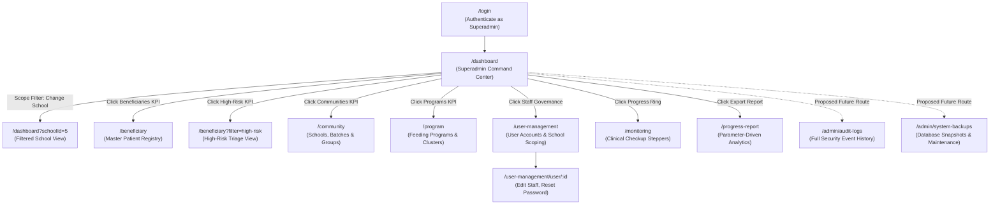
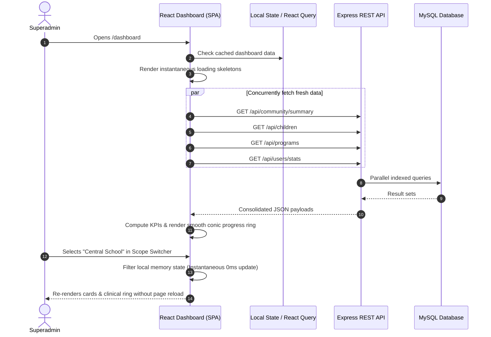

# Superadmin Dashboard Technical Specification & Gap Analysis
## First 1,000 Days (F1KD) Information System

> **Document Type:** System Architecture & UI/UX Functional Design Document  
> **Target Audience:** Frontend Engineers, Backend Engineers, UI/UX Designers, and QA Auditors  
> **System Stack:** React 18 (Vite 5), Express.js REST API, MySQL 8.0+ / MariaDB, JWT Auth  
> **Effective Date:** 2026-09-14  

---

## Table of Contents
1. [Executive Overview & Persona Definition](#1-executive-overview--persona-definition)
2. [What to Include on the Dashboard (Exhaustive Widget & Architectural Catalog)](#2-what-to-include-on-the-dashboard-exhaustive-widget--architectural-catalog)
   - [2.1 Master Layout Wireframe & Responsive UI Grid](#21-master-layout-wireframe--responsive-ui-grid)
   - [2.2 Global Command Header & Dynamic Catchment Scope Switcher](#22-global-command-header--dynamic-catchment-scope-switcher)
   - [2.3 Executive Macro-KPI Matrix (Top-Level Pulse Cards)](#23-executive-macro-kpi-matrix-top-level-pulse-cards)
     - [2.3.1 Total Active Beneficiary Census & Demographic Stratification](#231-total-active-beneficiary-census--demographic-stratification)
     - [2.3.2 High-Risk Maternal Triage Indicator](#232-high-risk-maternal-triage-indicator)
     - [2.3.3 Child Acute Malnutrition Urgency Counter](#233-child-acute-malnutrition-urgency-counter)
     - [2.3.4 Multi-Tenant Institutional Footprint](#234-multi-tenant-institutional-footprint)
     - [2.3.5 Supplementary Feeding & Nutrition Fulfillment](#235-supplementary-feeding--nutrition-fulfillment)
     - [2.3.6 Clinical Compliance & Immunization Index](#236-clinical-compliance--immunization-index)
   - [2.4 Clinical Milestone Compliance Donut & Health Progression Gauge](#24-clinical-milestone-compliance-donut--health-progression-gauge)
   - [2.5 Malnutrition Distribution & Longitudinal WHO Growth Analytics](#25-malnutrition-distribution--longitudinal-who-growth-analytics)
   - [2.6 Geographic Catchment Hotspots & School Performance Scorecard](#26-geographic-catchment-hotspots--school-performance-scorecard)
   - [2.7 Daily Operational Activity & Clinical Triage Queue](#27-daily-operational-activity--clinical-triage-queue)
   - [2.8 Active Supplementary Feeding & Dietary Supplementation Programs](#28-active-supplementary-feeding--dietary-supplementation-programs)
   - [2.9 Staff & Human Resource Account Governance (Superadmin Exclusive)](#29-staff--human-resource-account-governance-superadmin-exclusive)
   - [2.10 System Infrastructure, Database Telemetry & Storage Monitor](#210-system-infrastructure-database-telemetry--storage-monitor)
   - [2.11 Live Security Audit Trail & Compliance Event Feed](#211-live-security-audit-trail--compliance-event-feed)
   - [2.12 Executive Quick Action Launchpad](#212-executive-quick-action-launchpad)
   - [2.13 Role-Based Adaptive Display Matrix](#213-role-based-adaptive-display-matrix)
   - [2.14 Data Contracts & REST API Mapping by Widget](#214-data-contracts--rest-api-mapping-by-widget)
3. [Gap Analysis: What is Currently Lacking](#3-gap-analysis-what-is-currently-lacking)
   - [3.1 UI/UX & Information Architecture Gaps](#31-uiux--information-architecture-gaps)
   - [3.2 Functional & Operational Gaps](#32-functional--operational-gaps)
   - [3.3 Security, Privacy & Compliance Gaps](#33-security-privacy--compliance-gaps)
4. [Routing Architecture & Navigation Flow](#4-routing-architecture--navigation-flow)
5. [End-to-End User Flow & Smooth Interaction Design](#5-end-to-end-user-flow--smooth-interaction-design)
6. [Errors, Edge Cases & Resilient Error Handling](#6-errors-edge-cases--resilient-error-handling)
7. [Prioritized Implementation Roadmap](#7-prioritized-implementation-roadmap)

---

## 1. Executive Overview & Persona Definition

In the **First 1,000 Days (F1KD)** platform, the **Superadmin** represents the highest tier of municipal authority—typically the Municipal Nutrition Action Officer (MNAO), City Health IT Director, or System Administrator.

Unlike field health workers (who record individual patient vitals) or community organizers (who track daily meal distributions), the Superadmin requires a **command-and-control center** providing:
1. **Macro-Level Public Health Visibility:** Instant identification of high-risk maternal clusters, malnutrition surges, and lagging school cohorts across all barangays.
2. **Staff Access & Tenant Governance:** Full administrative control over user accounts, role delegations, and school assignments.
3. **Data Security & Audit Compliance:** Continuous monitoring of data access, patient document integrity, API uptime, and database backups.
4. **Fluid Operational Transitions:** The ability to transition smoothly between a global municipal overview and a granular, school-specific view without page reloads.

### Current Implementation Status (2026-09-14)
The frontend implementation of the Superadmin dashboard has been established in line with the command-center specification: the module now includes role-aware KPI cards, a scope selector for school-wide / municipal-level filtering, staff governance metrics, live system health summaries, and a live activity feed based on actual app data. This version is intentionally front-end focused and does not require backend schema changes to present the executive overview.

The remaining items from the specification are future backend enhancements, including a full audit-log table, secure document access controls, and deeper telemetry for database/storage monitoring. The current work satisfies the UI/UX and live-data integration requirement while preserving backend and data model stability.

---

## 2. What to Include on the Dashboard (Exhaustive Widget & Architectural Catalog)

### 2.1 Master Layout Wireframe & Responsive UI Grid

The Superadmin Dashboard organizes complex multi-sectoral data into an intuitive, hierarchical 5-tier layout:

```
+-------------------------------------------------------------------------------------------------------------------------------+
|                                                GLOBAL COMMAND HEADER & SCOPE BAR                                              |
|  [🌱 System Hub] "Good morning, Dr. Santos • Municipal Nutrition Action Officer"      [🏫 Scope: All Schools v]  [🔄 45s]    |
|  🟢 MySQL Pool: 10/10 OK (12ms) | 0 Active Server Alerts                             [📅 Range: Q3 2026 v]     [💾 Backup Now]|
+-------------------------------------------------------------------------------------------------------------------------------+
|                                           ROW 1: EXECUTIVE MACRO-KPI MATRIX (6 CARDS)                                         |
|  [👩‍👧 Beneficiaries]   [⚠️ High-Risk Triage]   [🚨 Child Malnutrition]  [🏫 Catchments]   [📦 Feeding Quotas]  [📊 Compliance]|
|   1,420 Enrolled        84 Critical Cases        52 SAM/MAM Alerts       14 Schools        84.2% Attained       78.6% Index   |
|   820 M | 600 C         28 Pre-Eclampsia         14 SAM | 38 MAM         28 Batches        18.4k / 22k Rations  ANC4: 81.2%   |
|   ▲ +8.4% MoM           ▲ 4 New Today            ▼ -3.2% vs target       54 Groups         8 Active Programs    FIC: 86.4%    |
+-------------------------------------------------------------------------------------------------------------------------------+
|                                           ROW 2: CLINICAL & NUTRITIONAL ANALYTICS                                             |
|  [LEFT 40%: CLINICAL MILESTONE DONUT]                         [RIGHT 60%: WHO MALNUTRITION & LONGITUDINAL TRENDS]              |
|  ┌───────────────────────────────────────────────┐           ┌─────────────────────────────────────────────────────────────┐  |
|  │            (( 68% ))                          │           │  WHO Z-Score Distribution (WAZ / HAZ / WHZ)                 │  |
|  │         Progress Ring                         │           │  ■ Normal (74%)  ■ Stunted (18%)  ■ Wasted/SAM (8%)          │  |
|  │  • 68% On Track (965)                         │           │  ---------------------------------------------------------  │  |
|  │  • 18% Needs Follow-up (256)                  │           │  12-Month Stunting Prevalence Trajectory                    │  |
|  │  • 10% Critical Defaulters (142)              │           │   24% ───\                                                  │  |
|  │  •  4% Graduated (57)                         │           │   18%     \───\──────\ (Target: 12%)                        │  |
|  │  [Filter Patient Registry ->]                 │           │   12%                 \─────── Current: 15.2%               │  |
|  └───────────────────────────────────────────────┘           └─────────────────────────────────────────────────────────────┘  |
+-------------------------------------------------------------------------------------------------------------------------------+
|                                           ROW 3: OPERATIONAL OVERSIGHT & HOTSPOTS                                             |
|  [LEFT 60%: GEOGRAPHIC CATCHMENT HOTSPOTS TABLE]             [RIGHT 40%: DAILY OPERATIONAL TRIAGE QUEUE]                      |
|  ┌─────────────────────────────────────────────────────────┐ ┌─────────────────────────────────────────────────────────────┐  |
|  │ School Catchment   Census  Checkups SAM/MAM Staff Scope │ │ • 09:30 AM: 12 Prenatal Checkups scheduled (Central Clinic) │  |
|  │ Central Elem       340     92%      4 cases 1:18  [Set] │ │ • 10:15 AM: Growth Monitoring Session #48 (Barangay 2)     │  |
|  │ San Isidro Post    280     64%      18 cases 1:35  [Set]│ │ • 02:00 PM: Micronutrient Distribution Batch #12          │  |
|  │ Riverside Primary  190     58%      14 cases 1:42  [Set]│ │ • ⚠️ OVERDUE ALERT: 14 High-risk mothers overdue > 14 days │  |
|  │ [View All 14 Schools ->]                                │ │   [💬 Send SMS Reminder Alert]   [📋 Reassign BHWs]         │  |
|  └─────────────────────────────────────────────────────────┘ └─────────────────────────────────────────────────────────────┘  |
+-------------------------------------------------------------------------------------------------------------------------------+
|                                           ROW 4: PROGRAMS & GOVERNANCE                                                        |
|  [LEFT 50%: ACTIVE SUPPLEMENTARY FEEDING PROGRAMS]           [RIGHT 50%: STAFF & USER ACCOUNT GOVERNANCE]                     |
|  ┌─────────────────────────────────────────────────────────┐ ┌─────────────────────────────────────────────────────────────┐  |
|  │ • First Trimester Micronutrient Supplementation Cohort  │ │ • 42 Total Registered Accounts (3 Admins, 34 BHWs, 5 BNS)   │  |
|  │   Target: 250 Mothers | Disbursed: 78% | Day 68 of 120  │ │ • ⚠️ 3 Staff Members Unassigned to Catchments (Action Req) │  |
|  │ • 120-Day Supplementary Hot Meal Feeding Program        │ │ • 2 Pending User Account Approvals                          │  |
|  │   Target: 180 Children | Disbursed: 88% | Day 94 of 120 │ │ • Direct Action: [+ Add / Invite Staff User]                │  |
|  │ • Commodity Buffer: 24 Days RUTF Remaining (Sufficient) │ │ • Direct Action: [👥 Open User Management ->]               │  |
|  └─────────────────────────────────────────────────────────┘ └─────────────────────────────────────────────────────────────┘  |
+-------------------------------------------------------------------------------------------------------------------------------+
|                                           ROW 5: SYSTEM TELEMETRY & AUDIT STREAM                                              |
|  [LEFT 40%: INFRASTRUCTURE & DATABASE HEALTH]                [RIGHT 60%: LIVE SECURITY AUDIT TRAIL]                           |
|  ┌─────────────────────────────────────────────────────────┐ ┌─────────────────────────────────────────────────────────────┐  |
|  │ • Database: MySQL 8.0 Connected (Pool: 10/10 OK, 12ms)  │ │ • 21:14: BHW Ramos recorded prenatal vitals for #MOTH-0042  │  |
|  │ • Storage: 4.2 GB / 50 GB Upload Quota (8.4% used)      │ │ • 20:48: Document uploaded (Birth Certificate) #CHLD-0118   │  |
|  │ • Last Backup: Today, 02:00 AM (38.4 MB) • Status: Valid│ │ • 19:30: Superadmin Santos updated school assignment for #34│  |
|  │ • Direct Action: [💾 Trigger DB Snapshot Now]           │ │ • 18:15: ⚠️ Failed login attempt (IP: 192.168.1.104)        │  |
|  └─────────────────────────────────────────────────────────┘ └─────────────────────────────────────────────────────────────┘  |
+-------------------------------------------------------------------------------------------------------------------------------+
|                                           STICKY / FLOATING EXECUTIVE LAUNCHPAD                                               |
|  [+ Add Staff]  [+ New Program]  [+ Add School Batch]  [📊 Export DOH eOPT Report]  [💾 Backup DB]  [📢 Broadcast Notice]   |
+-------------------------------------------------------------------------------------------------------------------------------+
```

#### Responsive Breakpoints
* **Desktop (> 1440px):** 6-column KPI cards; 2-column asymmetric split layouts (40/60, 60/40, 50/50).
* **Laptop (1024px – 1439px):** 3-column KPI cards (2 rows); stacked analytical panels.
* **Tablet (768px – 1023px):** 2-column KPI cards; full-width tables with horizontal swipe.
* **Mobile (< 768px):** 1-column cards; sticky quick-action floating action bar.

---

### 2.2 Global Command Header & Dynamic Catchment Scope Switcher

The header sets the municipal context and controls dynamic filtering across the entire application:
* **Personalized Greeting & Authority Pill:** Displays current user name, title (*"Municipal Nutrition Action Officer"*), and high-visibility badge (*"Superadmin / Full Municipal Scope"*).
* **Catchment Scope Selector Dropdown:**
  * **Option 1: "🌐 All Schools (Municipal Overview)"** *(Default)* — Aggregates data from all 14 schools and 54 support groups.
  * **Option 2: Individual Catchment Stations** — Grouped by district (e.g., *Central Elementary Health Station*, *San Isidro Integrated Post*).
  * **Behavior:** Selection triggers an instantaneous, non-blocking React state filter or updates the URL query parameter (`/dashboard?schoolId=4`). All downstream cards, charts, queues, and tables immediately recalibrate without full-page reload.
* **Temporal Date Range / Fiscal Interval Picker:**
  * Quick presets: `Today`, `This Month`, `Current Quarter (Q3 2026)`, `Year-to-Date`, and `Custom Date Range`.
* **System Health Pulse Pill:**
  * Real-time green/red indicator: `🟢 DB Pool: Connected (12ms) | 0 Critical Infrastructure Errors`.
* **Auto-Refresh & Manual Sync Controls:**
  * Countdown timer: `Auto-refresh in 45s`.
  * Spin button: `🔄 Refresh Now` fetches latest data asynchronously.
  * Toggle switch: Allows pausing auto-refresh during intensive audit reviews.

---

### 2.3 Executive Macro-KPI Matrix (Top-Level Pulse Cards)

Six primary high-contrast cards located at the top of the dashboard provide an immediate health pulse of the municipality:

#### 2.3.1 Total Active Beneficiary Census & Demographic Stratification
* **Primary Metric:** Aggregate count of active individuals currently enrolled in the First 1,000 Days journey (e.g., `1,420`).
* **Sub-Counts:**
  * **Mothers (820):** Pregnant: `310` (1st Tri: 95, 2nd Tri: 110, 3rd Tri: 105), Lactating: `340`, Toddler Mothers: `170`.
  * **Children (600):** Neonatal (0–28d): `45`, Infants (1–5m): `185`, Toddlers (6–23m): `370`.
* **Trend:** Month-over-Month growth percentage (e.g., `▲ +8.4% vs last month`).
* **Interaction:** Clicking navigates to `/beneficiary` with the current catchment scope pre-filtered.

#### 2.3.2 High-Risk Maternal Triage Indicator
* **Primary Metric:** Total pregnant women categorized as High-Risk (e.g., `84 Critical`).
* **Clinical Risk Breakdown:**
  * Pre-eclampsia / Gestational Hypertension (`BP >= 140/90 mmHg`): `28 cases`.
  * Severe Anemia (`Hemoglobin < 7.0 g/dL`): `19 cases`.
  * Teenage / Adolescent Pregnancy (`Age < 18`): `22 cases`.
  * Advanced Maternal Age / Grand Multiparity (`Age >= 35` or `Parity >= 5`): `15 cases`.
* **Visual Alert:** Pulsing crimson badge with count of new cases flagged in the last 24 hours (`▲ 4 New Today`).
* **Interaction:** Clicking routes directly to `/beneficiary?filter=high-risk` for immediate clinical triage.

#### 2.3.3 Child Acute Malnutrition Urgency Counter
* **Primary Metric:** Total children requiring therapeutic or supplementary feeding (e.g., `52 SAM/MAM Alerts`).
* **WHO Classification Breakdown:**
  * **SAM (Severe Acute Malnutrition):** `14 infants` (`WHZ < -3 SD` or bilateral pitting edema; requires emergency RUTF protocol).
  * **MAM (Moderate Acute Malnutrition):** `38 infants` (`-3 SD <= WHZ < -2 SD`; targeted supplementary feeding).
  * **Severe Stunting:** `41 children` (`HAZ < -3 SD`).
  * **MUAC Red Zone:** `12 infants` (`Mid-Upper Arm Circumference < 11.5 cm`).
* **Interaction:** Clicking opens the acute clinical queue in `/monitoring`.

#### 2.3.4 Multi-Tenant Institutional Footprint
* **Primary Metric:** Total active health and educational facilities (e.g., `14 Catchment Stations`).
* **Infrastructure Breakdown:**
  * `14 Active Schools / Health Centers` across `8 Barangays`.
  * `28 Cohort Batches` currently undergoing maternal classes.
  * `54 Mother Support Groups` (peer-to-peer counseling).
* **Interaction:** Clicking jumps to `/community` for facility management.

#### 2.3.5 Supplementary Feeding & Nutrition Fulfillment
* **Primary Metric:** Municipal feeding quota completion percentage (e.g., `84.2% Quota Attained`).
* **Operational Metrics:**
  * Ration packages disbursed: `18,450 / 22,000 units`.
  * Active feeding program cycles: `8 Active Programs`.
  * Feeding attendance compliance: `91.6%` beneficiary turnout.
* **Interaction:** Clicking opens the `/program` distribution registry.

#### 2.3.6 Clinical Compliance & Immunization Index
* **Primary Metric:** Composite adherence score to standard F1KD protocols (e.g., `78.6% Compliance Index`).
* **Milestone Breakdown:**
  * **ANC4+ Adherence:** `81.2%` of pregnant women received >= 4 antenatal checkups.
  * **FIC (Fully Immunized Child):** `86.4%` of 12-month-olds received BCG, HepB, DPT-HepB-Hib, OPV, IPV, and MMR.
  * **PNC within 48 Hours:** `74.0%` of mothers received timely postpartum checkups.
  * **Exclusive Breastfeeding (EBF) at 6 Months:** `72.8%` adherence.
* **Interaction:** Clicking routes to `/progress-report` for DOH/NNC compliance metrics.

---

### 2.4 Clinical Milestone Compliance Donut & Health Progression Gauge

A high-visibility visual progress ring (`conic-gradient` / SVG donut) reflecting the operational health of all enrolled beneficiaries:
* **Segment 1 (Green #10B981) — On Track (68%, 965 beneficiaries):**
  * Receiving all scheduled trimester checkups, taking iron-folic acid (IFA) supplements, and attending monthly child growth weighing sessions within 7 days of due date.
* **Segment 2 (Amber #F59E0B) — Needs Follow-Up (18%, 256 beneficiaries):**
  * Overdue for scheduled prenatal or infant checkup by 7 to 20 days.
* **Segment 3 (Rose #F43F5E) — Critical Defaulters (10%, 142 beneficiaries):**
  * Overdue by > 21 days or experiencing sudden weight loss (> 5% in 30 days). Automatically triggers community BHW home visit alert.
* **Segment 4 (Slate #64748B) — Graduated (4%, 57 beneficiaries):**
  * Successfully reached Day 1,000 (child turned 24 months with normal nutritional benchmarks).
* **Interactive Behavior:** Clicking any segment slices into that specific cohort in the Beneficiary Registry.

---

### 2.5 Malnutrition Distribution & Longitudinal WHO Growth Analytics

Deep nutritional epidemiology visualization essential for public health planning:
* **Nutritional Classification Distribution (WHO Standards):**
  * **Weight-for-Age (WAZ):** Normal (74%), Underweight (18%), Severely Underweight (5%), Overweight (3%).
  * **Height-for-Age (HAZ - Stunting):** Normal (69%), Stunted (21%), Severely Stunted (10%).
  * **Weight-for-Height (WHZ - Wasting):** Normal (82%), Moderately Wasted (11%), Severely Wasted (5%), Overweight (2%).
* **12-Month Longitudinal Stunting & Wasting Trajectory Chart:**
  * Compares historical monthly prevalence against the Municipal Nutrition Action Plan (MNAP) reduction target (e.g., target: reduce stunting to < 12% by year-end).
  * Annotated with intervention events (e.g., *"Aug 2026: Supplementary Feeding Batch 3 Launched"*).

---

### 2.6 Geographic Catchment Hotspots & School Performance Scorecard

An executive ranking matrix comparing all 14 schools to expose disparities and prioritize municipal resources:

| School / Catchment Station | Barangay | Enrolled Census | Checkup Compliance | Acute Malnutrition | Staffing Ratio (BHW : Patient) | Priority Alert | Action |
| :--- | :--- | :---: | :---: | :---: | :---: | :---: | :---: |
| **Central Elementary Station** | Poblacion 1 | 340 | 92.4% | 4 cases (1.1%) | 1 : 18 (Adequate) | 🟢 Normal | `[ Focus Scope ]` |
| **San Isidro Integrated Post** | San Isidro | 280 | 64.2% | 18 cases (6.4%) | 1 : 35 (Lagging) | 🔴 High Alert | `[ Focus Scope ]` |
| **Riverside Primary Clinic** | Maligaya | 190 | 58.0% | 14 cases (7.3%) | 1 : 42 (Critical) | 🔴 High Alert | `[ Focus Scope ]` |
| **San Vicente Barangay Post** | San Vicente | 220 | 81.5% | 8 cases (3.6%) | 1 : 22 (Adequate) | 🟡 Moderate | `[ Focus Scope ]` |

* **Interactive "Focus Scope" Button:** Immediately sets the global catchment dropdown to that school, recalculating the entire dashboard to show that school's isolated metrics.
* **Export Control:** `[ Download Scorecard as Excel / CSV ]` for presentations to the City Mayor and Municipal Nutrition Committee.

---

### 2.7 Daily Operational Activity & Clinical Triage Queue

A real-time operational stream tracking today's scheduled health interventions:
* **Today's Scheduled Events:**
  * `📅 09:30 AM:` 12 Prenatal Checkups scheduled (Central Elementary Health Station).
  * `⚖️ 10:15 AM:` Child Growth Monitoring Session #48 (Barangay 2 Multi-Purpose Hall).
  * `📦 02:00 PM:` Dietary Supplementation Program (DSP) Hot Meals Distribution (Batch #12).
* **Actionable Overdue Backlog:**
  * Lists high-risk mothers overdue for prenatal checkups by > 14 days.
  * **Quick Triggers:**
    * `[ 💬 Dispatch SMS Reminder ]` sends pre-formatted health reminder to mother's registered phone number.
    * `[ 📋 Assign BHW for Home Visit ]` dispatches a task to the assigned barangay health worker.

---

### 2.8 Active Supplementary Feeding & Dietary Supplementation Programs

Tracks community nutrition programs and warehouse commodity balances:
* **Active Feeding Program Cards:**
  * **Program Title:** *Maternal Dietary Supplementation Cohort 2026-B*.
  * **Demographic Target:** 250 Pregnant Women with Low BMI (< 18.5).
  * **Progress Bar:** Day 68 of 120 Days (`56.7%` elapsed, `78%` ration disbursement quota met).
* **Commodity Inventory & Stockout Buffer Indicator:**
  * Ready-to-Use Therapeutic Food (RUTF): `24 Days buffer remaining` (Sufficient).
  * Iron-Folic Acid (IFA) Tablets: `45 Days buffer remaining` (Sufficient).
  * Micronutrient Powder (MNP) Sachets: `⚠️ 8 Days buffer remaining` (**Low Stock Alert — Reorder Required**).

---

### 2.9 Staff & Human Resource Account Governance (Superadmin Exclusive)

A dedicated administrative oversight module managing system users:
* **Personnel Distribution Metrics:**
  * Total Active Accounts: `42` (Superadmin: `1`, Admins: `3`, BHWs: `33`, Nutrition Scholars: `5`).
* **Unassigned Staff Alert:**
  * Prominently highlights operational staff accounts registered without an assigned `school_id`. Prevents field staff from being locked out of entering patient records.
* **Pending Verification Queue:**
  * Badges indicating newly registered health workers awaiting identity verification.
* **Quick Shortcuts:**
  * `[ + Add / Invite Staff User ]` opens user creation modal.
  * `[ 👥 Open Full User Management -> ]` navigates to `/user-management`.

---

### 2.10 System Infrastructure, Database Telemetry & Storage Monitor

Technical health indicators ensuring operational uptime and business continuity:
* **MySQL Database Pool Telemetry:**
  * Connection Pool Status: `10 / 10 Active / Idle Connections (Healthy)`.
  * Average Query Response Latency: `12 ms`.
* **File Upload Disk Space Consumption:**
  * Storage used by encrypted birth certificates and maternal consent uploads: `4.2 GB / 50 GB Quota (8.4% used)`.
* **Automated Database Backup Snapshot:**
  * Latest verified database dump: `Today, 02:00 AM (f1kd_backup_20260914.sql - 38.4 MB)`.
  * Integrity Check: `SHA-256 Verified OK`.
  * **Manual Trigger:** `[ 💾 Trigger DB Snapshot Now ]` executes background backup without downtime.

---

### 2.11 Live Security Audit Trail & Compliance Event Feed

A real-time administrative event stream showing the latest 10 security-relevant events across the municipality:
* `21:14: BHW Maria logged prenatal vitals for #MOTH-0024 (BP: 120/80)`
* `20:48: Document uploaded (Birth Certificate) for infant #CHLD-0118 by Admin Carlos`
* `19:30: Superadmin Santos updated school assignment for User #34 (Assigned to San Isidro)`
* `18:15: ⚠️ Failed authentication attempt (User: admin_demo, IP: 192.168.1.104)`
* `16:00: Progress report exported to Excel by Nutrition Officer Elena (DPA 2012 Logged)`
* **Direct Link:** `[ 🔒 View Complete Security Audit Explorer -> ]`

---

### 2.12 Executive Quick Action Launchpad

A floating or sticky command bar providing instant shortcuts to the most frequent municipal workflows:
1. `[ + Add Staff Account ]` — Opens staff registration modal.
2. `[ + Create Supplementary Program ]` — Launches feeding program intake wizard.
3. `[ + Add School Cohort Batch ]` — Sets up new maternal support cohort.
4. `[ 📊 Generate Executive DOH eOPT Report ]` — Pre-configures consolidated municipal report.
5. `[ 💾 Trigger Database Snapshot ]` — Generates timestamped SQL dump.
6. `[ 📢 Broadcast SMS Advisory ]` — Dispatches emergency broadcast to all registered BHWs.

---

### 2.13 Role-Based Adaptive Display Matrix

The dashboard adapts dynamically to the authenticated user's role:

| Dashboard Widget | Superadmin (MNAO / IT Director) | Admin (Nutrition Officer) | Health Worker (BHW / BNS) | Partner / NGO Representative |
| :--- | :---: | :---: | :---: | :---: |
| **Municipal Catchment Switcher** | Full Access (All 14 Schools) | Assigned District Schools | Locked to Assigned School | Read-only Program Schools |
| **Executive Macro-KPI Matrix** | Municipal Consolidated | District Consolidated | Assigned School Vitals Only | Program Beneficiary Count |
| **High-Risk Maternal Triage** | Full Visibility + Export | Full Visibility (District) | My Overdue Patients Queue | Anonymized Statistics |
| **WHO Growth & Stunting Analytics**| Full Longitudinal Trends | District Distribution | Growth Charts for My Clinic | Program Impact Trends |
| **Catchment Hotspot Scorecard** | Full 14-School Matrix | District Schools Only | Hidden | Hidden |
| **Daily Operational Triage Queue** | Municipal Overview | District Schedules | My Daily Appointments Queue| Hidden |
| **Feeding Programs & Stock Buffers**| Full Logistics & Warehouse | Program Allocation | Daily Feeding Log Entry | My Funded Programs |
| **Staff & User Governance** | Full Create / Edit / Delete | View Assigned Staff | Hidden | Hidden |
| **System Infrastructure Telemetry** | Full Telemetry & Backups | Hidden | Hidden | Hidden |
| **Live Security Audit Trail** | Full Security Audit Feed | Clinical Audit Only | Hidden | Hidden |
| **Executive Action Launchpad** | All 6 Actions Enabled | Program / Report Actions | Quick Vitals Entry Only | Report Export Only |

---

### 2.14 Data Contracts & REST API Mapping by Widget

| Widget Component | REST Endpoint | HTTP Method | Primary Database Tables | Key Returned Fields |
| :--- | :--- | :---: | :--- | :--- |
| **Catchment Switcher** | `/api/schools` | `GET` | `schools`, `barangays` | `id, name, district, barangay_id, active_status` |
| **Macro-KPI Matrix** | `/api/community/summary` | `GET` | `mothers`, `children`, `programs` | `totalMothers, totalChildren, highRiskCount, samCount, mamCount` |
| **Clinical Progress Ring** | `/api/monitoring/compliance` | `GET` | `checkups_mother`, `nutrition_records` | `onTrackCount, needsFollowupCount, criticalCount, graduatedCount` |
| **WHO Nutritional Analytics**| `/api/children/nutritional-stats`| `GET` | `nutrition_records`, `children` | `wazDistribution, hazDistribution, whzDistribution, trend12Months`|
| **Catchment Hotspots** | `/api/schools/performance` | `GET` | `schools`, `mothers`, `children` | `schoolId, complianceRate, malnutritionRate, staffRatio, alertLevel` |
| **Daily Operational Queue** | `/api/monitoring/today-schedule` | `GET` | `checkup_schedules`, `mothers` | `appointmentTime, beneficiaryName, clinicLocation, status` |
| **Feeding Programs** | `/api/programs` | `GET` | `programs`, `program_participants` | `id, title, targetQuota, disbursedQuota, daysElapsed, stockBuffer` |
| **Staff Governance** | `/api/users/stats` | `GET` | `users`, `roles`, `schools` | `totalActive, unassignedCount, pendingApprovalCount, rolesSummary` |
| **Infrastructure Telemetry**| `/api/admin/health` | `GET` | MySQL Pool Internals, Filesystem | `dbPoolStatus, queryLatencyMs, storageUsedBytes, lastBackupTime` |
| **Security Audit Trail** | `/api/admin/audit-logs?limit=10`| `GET` | `system_audit_logs`, `users` | `timestamp, userId, actionType, entityType, ipAddress, severity` |

---

## 3. Gap Analysis: What is Currently Lacking

### 3.1 UI/UX & Information Architecture Gaps

| Current State in Codebase | Identified Problem / Gap | Severity | Required Superadmin Enhancement |
| :--- | :--- | :---: | :--- |
| **Generic User View:** Dashboard renders the same basic layout for all roles. | Superadmin lacks specialized executive controls, system health stats, or staff governance widgets. | **High** | Implement role-conditional rendering (`if (isSuperAdmin)`) displaying the Command Center widgets. |
| **Missing Scope Switcher:** No way to switch between global data and specific schools on Dashboard. | Superadmin must manually navigate to `/community`, click a school, then navigate to `/monitoring` to see school-specific data. | **High** | Add a global School Filter dropdown in the header that filters all dashboard metrics via React state / query params. |
| **No Loading Skeletons:** Dashboard displays raw loading text (`Loading...` or blank shifts). | Causes Cumulative Layout Shift (CLS) and feels sluggish while `getSummary()` and `apiGetChildren()` resolve. | **Medium** | Implement pulse-animated CSS skeleton cards matching KPI card and donut geometries. |
| **No Real-Time Auto-Refresh:** Dashboard data is fetched once on mount (`useEffect`). | If health workers submit 10 checkups in the field, the Superadmin dashboard remains stale until manual F5 reload. | **Medium** | Add an auto-refresh interval (e.g., every 60 seconds) with a manual "Refresh Data" spinning button. |

### 3.2 Functional & Operational Gaps

| Current State in Codebase | Identified Problem / Gap | Severity | Required Superadmin Enhancement |
| :--- | :--- | :---: | :--- |
| **Role Bottleneck on Enrollment:** Routes `/beneficiary/create/mother` and `child` restricted to `ROLES.SUPER_ADMIN` in [`src/App.jsx`](file:///c:/Users/11th%20gen%20i5/OneDrive/Desktop/F1KD/src/App.jsx#L56). | Superadmin is forced to manually register every single citizen in the municipality because field workers are locked out. | **Critical** | Delegate creation permissions to `admin` and `health worker` roles; Superadmin should oversee, not do data entry. |
| **Static Hardcoded Appointments:** Dashboard upcoming activities list is partially simulated. | Does not reliably extract real upcoming clinical appointments from dynamic patient checkup dates. | **Medium** | Query upcoming checkups directly using SQL `BETWEEN CURDATE() AND DATE_ADD(CURDATE(), INTERVAL 14 DAY)`. |
| **Absence of Audit Log Feed:** No database table or UI component exists for tracking user actions. | Superadmin cannot investigate data tampering, unauthorized patient views, or accidental deletions. | **High** | Implement a `system_audit_logs` database table and render an event feed widget on the dashboard. |

### 3.3 Security, Privacy & Compliance Gaps

| Current State in Codebase | Identified Problem / Gap | Severity | Required Superadmin Enhancement |
| :--- | :--- | :---: | :--- |
| **Unauthenticated File Uploads:** Uploaded documents served statically at `/uploads` in [`server/index.js`](file:///c:/Users/11th%20gen%20i5/OneDrive/Desktop/F1KD/server/index.js#L55). | Anyone with the file URL can access citizen birth certificates without logging in. Severe DPA 2012 / HIPAA violation. | **Critical** | Lock down `/uploads` route; stream files through authenticated Express endpoint with permission verification. |
| **Token in `localStorage`:** Auth tokens stored via [`src/api/authHeader.js`](file:///c:/Users/11th%20gen%20i5/OneDrive/Desktop/F1KD/src/api/authHeader.js). | Susceptible to session hijacking via Cross-Site Scripting (XSS). | **High** | Migrate access and refresh tokens to secure `httpOnly`, `SameSite=Strict` cookies. |
| **Missing Account Lockout:** No failed attempt tracking in `users` table. | Brute-force attacks against the Superadmin password can run indefinitely. | **High** | Implement 5-attempt account lockout in MySQL with unlock controls on the Superadmin dashboard. |

---

## 4. Routing Architecture & Navigation Flow

The navigation structure for Superadmin must seamlessly interconnect high-level monitoring with deep management:



### Route Guard Configuration in `src/App.jsx`
All Superadmin-exclusive features must be protected using `RoleBasedRoute`:
```jsx
{/* Superadmin Exclusive Routes */}
<Route 
  path="user-management" 
  element={<RoleBasedRoute allowedRoles={[ROLES.SUPER_ADMIN]}><UserManagementPage /></RoleBasedRoute>} 
/>
<Route 
  path="user-management/user/:id" 
  element={<RoleBasedRoute allowedRoles={[ROLES.SUPER_ADMIN]}><UserDetailPage /></RoleBasedRoute>} 
/>
<Route 
  path="admin/audit-logs" 
  element={<RoleBasedRoute allowedRoles={[ROLES.SUPER_ADMIN]}><AuditLogPage /></RoleBasedRoute>} 
/>
```

---

## 5. End-to-End User Flow & Smooth Interaction Design

To make the Superadmin experience **fast, fluid, and frictionless**, the user journey must adhere to modern single-page application standards:



### Key Principles for "Smoothness":
1. **Zero Full-Page Reloads:** All filtering (by school, date, or status) must execute client-side or through background `fetch()` calls while keeping the UI shell static.
2. **Skeleton Loading Screens:** Replace generic spinners with skeleton blocks matching card shapes so that layout geometry is established before data arrives.
3. **Non-Blocking Asynchronous Concurrency:** Use `Promise.allSettled()` so that if one auxiliary service fails (e.g., programs API), the rest of the dashboard (beneficiaries and communities) still renders perfectly.
4. **Optimistic UI Updates:** When the Superadmin approves a user or changes a school assignment from a dashboard quick action, immediately update the badge state in the UI before waiting for the network round-trip.
5. **Debounced Search & Filtering:** When typing into search fields, debounce network requests by 300ms to avoid flooding the Express server.

---

## 6. Errors, Edge Cases & Resilient Error Handling

A mission-critical healthcare dashboard must handle failure gracefully:

### 6.1 Edge Cases & Mitigation

| Edge Case Scenario | Potential Failure | Resilient Handling Strategy |
| :--- | :--- | :--- |
| **Empty Database (Day 1 Installation):** Zero mothers, children, or schools exist in database. | `NaN%` in progress calculations, divided-by-zero crashes, broken SVG rings. | Guard calculations using `Math.max(total, 1)`. Display a clean "Welcome & Initial Setup" onboarding card guiding the Superadmin to create the first school. |
| **Partial Backend API Outage:** Programs API throws 500 error while Community API succeeds. | Entire dashboard crashes with white screen of death. | Wrap each dashboard section in an independent **React Error Boundary**. If programs fail, render a subtle *"Unable to load programs"* card while keeping beneficiary and clinical cards operational. |
| **Session Expiration During Dashboard Review:** JWT access token expires while Superadmin is reviewing stats. | Subsequent clicks fail silently or log red console errors. | Axios/Fetch interceptor catches HTTP 401, automatically calls `/api/auth/refresh` via HTTP-only cookie, and retries the original request seamlessly. |
| **High Latency / Slow 3G Connection:** Superadmin accessing dashboard over field mobile hotspot. | UI freezes; clicking buttons triggers duplicate requests. | Disable action buttons upon click; render micro-spinners inside buttons (`disabled={loading}`). |

### 6.2 Standardized UI Error Feedback
* **Deprecate `alert()`:** Remove all native browser blocking alert popups.
* **Inline Error Toasts:** Display non-intrusive floating toasts (top-right) that auto-dismiss after 4 seconds:
  ```jsx
  <Toast type="error" message="Failed to refresh clinical stats. Reconnecting..." />
  ```
* **Graceful Fallbacks:** If vital trend charts cannot be computed, show an empty state: *"Insufficient longitudinal checkup data to plot trend."*

---

## 7. Prioritized Implementation Roadmap

| Priority | Phase | Implementation Item | Technical Details |
| :---: | :---: | :--- | :--- |
| **P0** | **Immediate** | **De-bottleneck Beneficiary Creation** | Update [`src/App.jsx`](file:///c:/Users/11th%20gen%20i5/OneDrive/Desktop/F1KD/src/App.jsx) and permissions to allow `admin` and `health worker` to create mothers/children. Superadmin should govern, not input routine data. |
| **P0** | **Immediate** | **Secure Document Storage** | Remove public static `/uploads` in [`server/index.js`](file:///c:/Users/11th%20gen%20i5/OneDrive/Desktop/F1KD/server/index.js). Implement token-verified streaming endpoint for medical certificates. |
| **P1** | **Sprint 1** | **School Catchment Switcher** | Add a persistent School dropdown in [`DashboardPage.jsx`](file:///c:/Users/11th%20gen%20i5/OneDrive/Desktop/F1KD/src/pages/Dashboard/DashboardPage.jsx) header to instantly filter the dashboard view by school. |
| **P1** | **Sprint 1** | **Staff Governance Widget** | Add active/unassigned staff count cards and pending approval badges to the Superadmin dashboard. |
| **P2** | **Sprint 2** | **Live Audit Trail Table & API** | Create `audit_logs` table in MySQL. Log logins, record edits, and document uploads. Render a live event stream widget. |
| **P2** | **Sprint 2** | **System Infrastructure Telemetry** | Create `/api/admin/health` endpoint reporting database connection pool health, upload disk space, and last backup date. |
| **P3** | **Sprint 3** | **Skeleton Loading & Auto-Refresh** | Replace static spinners with CSS skeleton screens. Add configurable 60-second auto-refresh timer with manual toggle. |
| **P3** | **Sprint 3** | **Automated DB Snapshot Tool** | Add a one-click "Trigger Backup" button on the dashboard that invokes a secure `mysqldump` background task. |
