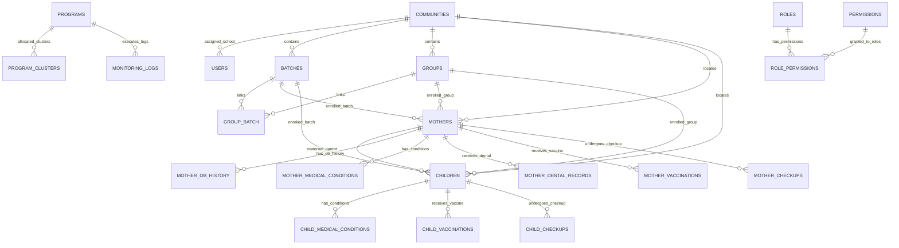

# First 1,000 Days (F1KD) Information System
## Section 3.5: Database Metadata & Schema Documentation

> **Document Reference:** Section 3.5 Database Metadata  
> **Project Name:** First 1,000 Days (F1KD) Maternal & Child Health and Nutrition Monitoring System  
> **Database Management System:** MySQL 8.0 / MariaDB (InnoDB Storage Engine)  
> **Character Set / Collation:** `utf8mb4` / `utf8mb4_general_ci`  
> **Target Runtime:** Node.js Express REST API backend (`mysql2/promise`)  
> **Generation Date:** 2026-09-14  

---

## Table of Contents
1. [System Overview & Architecture](#1-system-overview--architecture)
2. [Entity-Relationship Diagram (ERD)](#2-entity-relationship-diagram-erd)
3. [Data Dictionary](#3-data-dictionary)
   - [3.1 batches](#31-batches)
   - [3.2 child_checkups](#32-child-checkups)
   - [3.3 child_medical_conditions](#33-child-medical-conditions)
   - [3.4 child_vaccinations](#34-child-vaccinations)
   - [3.5 children](#35-children)
   - [3.6 communities](#36-communities)
   - [3.7 group_batch](#37-group-batch)
   - [3.8 groups](#38-groups)
   - [3.9 monitoring_logs](#39-monitoring-logs)
   - [3.10 mother_checkups](#310-mother-checkups)
   - [3.11 mother_dental_records](#311-mother-dental-records)
   - [3.12 mother_medical_conditions](#312-mother-medical-conditions)
   - [3.13 mother_ob_history](#313-mother-ob-history)
   - [3.14 mother_vaccinations](#314-mother-vaccinations)
   - [3.15 mothers](#315-mothers)
   - [3.16 program_clusters](#316-program-clusters)
   - [3.17 programs](#317-programs)
   - [3.18 users](#318-users)
   - [3.19 RBAC Infrastructure Tables](#319-rbac-infrastructure-tables-roles-permissions-role_permissions)
4. [SQL DDL Scripts (Data Definition Language)](#4-sql-ddl-scripts-data-definition-language)
5. [Indexes & Performance Optimization](#5-indexes--performance-optimization)
6. [Database Views & Recommended Analytics Views](#6-database-views--recommended-analytics-views)
7. [Export & Technical Report Linking Guide](#7-export--technical-report-linking-guide)

---

## 1. System Overview & Architecture

The **First 1,000 Days (F1KD)** database is architected to power an integrated clinical, nutritional, and administrative monitoring platform. The global First 1,000 Days public health initiative encompasses the critical window of human development spanning from maternal conception through a child's second birthday (24 months).

The schema is partitioned into five functional core domains:

1. **Identity, Authentication & Scoped Access:** User profiles, encrypted credentials, school/community location scoping, and role-based permissions (`users`, `roles`, `permissions`, `role_permissions`).
2. **Community & Group Organization Hierarchy:** Geographic and administrative nesting (`communities`, `batches`, `groups`, `group_batch`).
3. **Maternal Health & Clinical Tracking:** Master maternal records, obstetric history, medical conditions, dental examinations, vaccinations, and trimester checkups (`mothers`, `mother_ob_history`, `mother_medical_conditions`, `mother_dental_records`, `mother_vaccinations`, `mother_checkups`).
4. **Pediatric Growth & Immunization Monitoring:** Infant birth records, congenital/pediatric conditions, immunizations, and weekly/monthly growth checkups (`children`, `child_medical_conditions`, `child_vaccinations`, `child_checkups`).
5. **Program Management & Nutritional Intervention Monitoring:** Supplementary feeding programs, geographic quota clusters, and daily/periodic intervention attendance logs (`programs`, `program_clusters`, `monitoring_logs`).

---

## 2. Entity-Relationship Diagram (ERD)

The following Mermaid.js ERD models the entities, primary keys, foreign key constraints, and relational cardinality across the F1KD database.



---

## 3. Data Dictionary

### 3.1 `batches`

**Purpose:** Operational cohort batches grouping beneficiaries for scheduled checkups and food/milk supplementation.

| Column Name | Data Type | Nullable | Key / Constraint | Default Value | Description |
| :--- | :--- | :--- | :--- | :--- | :--- |
| `id` | `int(11)` | **No** | **PK** `AUTO_INCREMENT` | `NULL` | Primary key identifier for the cohort batch. |
| `batch_code` | `varchar(20)` | **No** | **UK** (Unique) | `NULL` | Unique alphanumeric batch code (e.g., BATCH-2026-01). |
| `community_id` | `int(11)` | **No** | Index / FK | `NULL` | Foreign key referencing the parent community/school. |
| `name` | `varchar(150)` | **No** | - | `NULL` | Descriptive title or name of the cohort batch. |
| `records` | `int(11)` | **No** | - | `0` | Cached count of enrolled beneficiary records within the batch. |
| `progress` | `int(11)` | **No** | - | `0` | Aggregated progress percentage (0-100%) of milestone completion. |
| `status` | `varchar(20)` | **No** | - | `NULL` | Current operational status of the batch (e.g., Active, Completed, Pending). |
| `created_at` | `timestamp` | **No** | - | `current_timestamp()` | Record creation timestamp. |

### 3.2 `child_checkups`

**Purpose:** Weekly/monthly pediatric growth monitoring checkups (weight, height, head circumference, developmental milestones).

| Column Name | Data Type | Nullable | Key / Constraint | Default Value | Description |
| :--- | :--- | :--- | :--- | :--- | :--- |
| `id` | `int(11)` | **No** | **PK** `AUTO_INCREMENT` | `NULL` | Primary key identifier for pediatric growth monitoring visit. |
| `child_id` | `int(11)` | **No** | Index / FK | `NULL` | Foreign key referencing children(id). |
| `week_number` | `tinyint(3) unsigned` | Yes | - | `NULL` | Chronological age in weeks (1 to 48 weeks monitoring schedule). |
| `visit_date` | `date` | Yes | - | `NULL` | Date of clinical growth measurement. |
| `weight` | `decimal(5,2)` | Yes | - | `NULL` | Weight in kilograms (kg) measured on calibrated pediatric scale. |
| `height` | `decimal(5,2)` | Yes | - | `NULL` | Length or height in centimeters (cm) measured on length board / stadiometer. |
| `head_circumference` | `decimal(5,2)` | Yes | - | `NULL` | Head circumference in centimeters (cm). |
| `developmental_status` | `varchar(40)` | Yes | - | `NULL` | Milestone assessment (Age Appropriate, Delayed, Advanced). |
| `service_provider` | `varchar(150)` | Yes | - | `NULL` | Health personnel administering measurement. |
| `notes` | `text` | Yes | - | `NULL` | Clinical observations, feeding evaluation, and counseling provided. |
| `next_checkup_date` | `date` | Yes | - | `NULL` | Scheduled date for upcoming growth checkup. |

### 3.3 `child_medical_conditions`

**Purpose:** Diagnosed medical and congenital conditions for pediatric beneficiaries.

| Column Name | Data Type | Nullable | Key / Constraint | Default Value | Description |
| :--- | :--- | :--- | :--- | :--- | :--- |
| `id` | `int(11)` | **No** | **PK** `AUTO_INCREMENT` | `NULL` | Primary key identifier. |
| `child_id` | `int(11)` | **No** | Index / FK | `NULL` | Foreign key referencing children(id). |
| `condition_name` | `varchar(80)` | **No** | - | `NULL` | Name of the pediatric medical condition (e.g., Jaundice, Pneumonia). |
| `has_condition` | `tinyint(1)` | **No** | - | `0` | Boolean indicator of diagnosis. |

### 3.4 `child_vaccinations`

**Purpose:** Pediatric immunization records (e.g., BCG, Hepatitis B, Pentavalent, OPV, IPV, PCV, MMR).

| Column Name | Data Type | Nullable | Key / Constraint | Default Value | Description |
| :--- | :--- | :--- | :--- | :--- | :--- |
| `id` | `int(11)` | **No** | **PK** `AUTO_INCREMENT` | `NULL` | Primary key identifier for child immunization. |
| `child_id` | `int(11)` | **No** | Index / FK | `NULL` | Foreign key referencing children(id). |
| `vaccine_name` | `varchar(50)` | **No** | - | `NULL` | Antigen name (e.g., BCG, Hep B, Pentavalent 1, OPV 1, PCV 1, MMR 1). |
| `vaccine_date` | `date` | Yes | - | `NULL` | Date vaccine dose was administered. |
| `remarks` | `text` | Yes | - | `NULL` | Lot number, administrator name, or clinical observations. |

### 3.5 `children`

**Purpose:** Core pediatric beneficiary registry storing birth measurements, delivery details, newborn screening, and nutrition status.

| Column Name | Data Type | Nullable | Key / Constraint | Default Value | Description |
| :--- | :--- | :--- | :--- | :--- | :--- |
| `id` | `int(11)` | **No** | **PK** `AUTO_INCREMENT` | `NULL` | Primary key identifier for the child beneficiary. |
| `child_code` | `varchar(30)` | **No** | **UK** (Unique) | `NULL` | Unique alphanumeric public code for the child (e.g., CHLD-0001). |
| `mother_id` | `int(11)` | **No** | Index / FK | `NULL` | Foreign key referencing the mother (mothers.id). |
| `community_id` | `int(11)` | Yes | Index / FK | `NULL` | Foreign key referencing the residence community (communities.id). |
| `group_id` | `int(11)` | Yes | Index / FK | `NULL` | Foreign key referencing the assigned support group (groups.id). |
| `batch_id` | `int(11)` | Yes | Index / FK | `NULL` | Foreign key referencing the cohort batch (batches.id). |
| `first_name` | `varchar(120)` | **No** | - | `NULL` | Given name of the child. |
| `middle_name` | `varchar(120)` | Yes | - | `NULL` | Middle name of the child. |
| `last_name` | `varchar(120)` | **No** | - | `NULL` | Family surname of the child. |
| `suffix` | `varchar(30)` | Yes | - | `NULL` | Name suffix (e.g., Jr., II). |
| `birth_date` | `date` | Yes | - | `NULL` | Date of birth. |
| `birth_weight` | `decimal(5,2)` | Yes | - | `NULL` | Birth weight in kilograms (kg). |
| `birth_length` | `decimal(5,2)` | Yes | - | `NULL` | Birth length/height in centimeters (cm). |
| `gender` | `enum('Male','Female','Other')` | Yes | - | `Female` | Biological sex of the infant (Male, Female, Other). |
| `blood_type` | `varchar(5)` | Yes | - | `NULL` | Blood type of the child (e.g., O+, A+, B+). |
| `no_of_child_delivered` | `int(11)` | Yes | - | `NULL` | Birth order / total children delivered in this pregnancy. |
| `multiple_birth_type` | `varchar(30)` | Yes | - | `NULL` | Multiplicity type (Single, Twin, Triplet, etc.). |
| `exclusive_breastfeeding` | `varchar(20)` | Yes | - | `NULL` | Indicator of exclusive breastfeeding practice (Yes/No/Partial). |
| `expanded_newborn_screening` | `text` | Yes | - | `NULL` | Status of Expanded Newborn Screening (ENBS) panel. |
| `expanded_newborn_screening_result` | `text` | Yes | - | `NULL` | Clinical laboratory result summary of ENBS. |
| `delivery_type` | `varchar(80)` | Yes | - | `NULL` | Mode of delivery (Normal Spontaneous, Cesarean Section, etc.). |
| `health_status` | `varchar(120)` | Yes | - | `NULL` | General pediatric physical health status assessment. |
| `birth_place` | `varchar(150)` | Yes | - | `NULL` | Birth facility or hospital name and location. |
| `birth_attendant` | `varchar(150)` | Yes | - | `NULL` | Professional attending delivery (Doctor, Midwife, Nurse). |
| `apgar_score` | `varchar(10)` | Yes | - | `NULL` | Standard APGAR score evaluated at 1 and 5 minutes post-birth. |
| `feeding_type` | `varchar(80)` | Yes | - | `NULL` | Current feeding method (Breastmilk, Formula, Mixed). |
| `nutrition_notes` | `text` | Yes | - | `NULL` | Dietary, nutritional, and complementary feeding notes. |
| `father_name` | `varchar(150)` | Yes | - | `NULL` | Full legal name of the childs father. |
| `relationship` | `varchar(50)` | Yes | - | `NULL` | Legal relationship of guardian/informant to the child. |
| `address` | `text` | Yes | - | `NULL` | Physical residence address. |
| `progress` | `int(11)` | Yes | - | `0` | Pediatric developmental milestone completion percentage (0-100%). |
| `created_at` | `timestamp` | **No** | - | `current_timestamp()` | Record creation timestamp. |
| `birth_document_name` | `varchar(255)` | Yes | - | `NULL` | Uploaded birth certificate document filename. |
| `birth_document_path` | `varchar(500)` | Yes | - | `NULL` | Server storage path of uploaded birth certificate. |

### 3.6 `communities`

**Purpose:** Master registry of geographic administrative units, barangays, or assigned school catchment zones.

| Column Name | Data Type | Nullable | Key / Constraint | Default Value | Description |
| :--- | :--- | :--- | :--- | :--- | :--- |
| `id` | `int(11)` | **No** | **PK** `AUTO_INCREMENT` | `NULL` | Primary key identifier for the community entity. |
| `community_code` | `varchar(20)` | **No** | **UK** (Unique) | `NULL` | Unique alphanumeric identifier code for the community/school. |
| `name` | `varchar(150)` | **No** | - | `NULL` | Official name of the community, barangay, or educational institution. |
| `area` | `varchar(80)` | **No** | - | `NULL` | Geographic cluster, district, or administrative zone. |
| `created_at` | `timestamp` | **No** | - | `current_timestamp()` | Record creation timestamp. |

### 3.7 `group_batch`

**Purpose:** Associative junction table establishing many-to-many relationships between groups and operational batches.

| Column Name | Data Type | Nullable | Key / Constraint | Default Value | Description |
| :--- | :--- | :--- | :--- | :--- | :--- |
| `group_id` | `int(11)` | **No** | **PK** | `NULL` | Foreign key referencing groups(id). Composite PK part 1. |
| `batch_id` | `int(11)` | **No** | **PK** | `NULL` | Foreign key referencing batches(id). Composite PK part 2. |

### 3.8 `groups`

**Purpose:** Mother-support groups and community clusters led by community leaders/focal persons.

| Column Name | Data Type | Nullable | Key / Constraint | Default Value | Description |
| :--- | :--- | :--- | :--- | :--- | :--- |
| `id` | `int(11)` | **No** | **PK** `AUTO_INCREMENT` | `NULL` | Primary key identifier for the mother/community support group. |
| `group_code` | `varchar(20)` | **No** | **UK** (Unique) | `NULL` | Unique alphanumeric identifier code for the group. |
| `community_id` | `int(11)` | **No** | Index / FK | `NULL` | Foreign key referencing the parent community (communities.id). |
| `name` | `varchar(150)` | **No** | - | `NULL` | Official name or title of the group. |
| `leader` | `varchar(150)` | Yes | - | `NULL` | Full name or identifier of the designated group leader/focal person. |
| `members_count` | `int(11)` | **No** | - | `0` | Cached count of active members enrolled in the group. |
| `status` | `varchar(20)` | **No** | - | `NULL` | Group status (e.g., Active, Inactive). |
| `created_at` | `timestamp` | **No** | - | `current_timestamp()` | Record creation timestamp. |

### 3.9 `monitoring_logs`

**Purpose:** Daily activity and intervention execution logs recording attendance and receipt of program services.

| Column Name | Data Type | Nullable | Key / Constraint | Default Value | Description |
| :--- | :--- | :--- | :--- | :--- | :--- |
| `id` | `int(11)` | **No** | **PK** `AUTO_INCREMENT` | `NULL` | Primary key identifier for daily activity execution log. |
| `beneficiary_id` | `varchar(50)` | **No** | Index / FK | `NULL` | Alphanumeric code of the beneficiary (references mother_code or child_code). |
| `beneficiary_type` | `varchar(20)` | **No** | - | `NULL` | Entity type classifier (Mother or Child). |
| `program_id` | `int(11)` | **No** | Index / FK | `NULL` | Foreign key referencing programs(id). |
| `monitored` | `tinyint(1)` | **No** | - | `0` | Boolean flag indicating successful attendance or commodity receipt. |
| `monitored_date` | `date` | **No** | - | `NULL` | Date of the monitored event or feeding session. |
| `monitored_by` | `int(11)` | Yes | - | `NULL` | User ID of the health worker/partner recording the log (users.id). |
| `notes` | `text` | Yes | - | `NULL` | Operational remarks regarding absence, consumption, or health status. |
| `created_at` | `timestamp` | **No** | - | `current_timestamp()` | Record creation timestamp. |
| `updated_at` | `timestamp` | **No** | - | `current_timestamp()` | Timestamp of last modification. |

### 3.10 `mother_checkups`

**Purpose:** Trimester-based prenatal and postpartum clinical check-up records, vitals, fundal height, FHR, subsidies, and referrals.

| Column Name | Data Type | Nullable | Key / Constraint | Default Value | Description |
| :--- | :--- | :--- | :--- | :--- | :--- |
| `id` | `int(11)` | **No** | **PK** `AUTO_INCREMENT` | `NULL` | Primary key identifier for prenatal checkup record. |
| `mother_id` | `int(11)` | **No** | Index / FK | `NULL` | Foreign key referencing mothers(id). |
| `trimester` | `varchar(30)` | **No** | - | `NULL` | Clinical trimester classification (1st Trimester, 2nd Trimester, 3rd Trimester). |
| `checkup_number` | `int(11)` | **No** | - | `NULL` | Sequential visit number within the corresponding trimester. |
| `checkup_date` | `date` | Yes | - | `NULL` | Date the clinical checkup was conducted. |
| `gestational_age_weeks` | `int(11)` | Yes | - | `NULL` | Gestational age in completed weeks at the time of checkup. |
| `blood_pressure` | `varchar(30)` | Yes | - | `NULL` | Maternal systolic and diastolic blood pressure reading (e.g. 110/70). |
| `weight_kg` | `decimal(5,2)` | Yes | - | `NULL` | Maternal weight in kilograms (kg). |
| `height_cm` | `decimal(5,2)` | Yes | - | `NULL` | Standing maternal height in centimeters (cm). |
| `bmi` | `decimal(5,2)` | Yes | - | `NULL` | Calculated Body Mass Index (weight in kg / height in meters squared). |
| `nutritional_status` | `varchar(80)` | Yes | - | `NULL` | Nutritional status classification (Underweight, Normal, Overweight, Obese). |
| `fundal_height_cm` | `decimal(5,2)` | Yes | - | `NULL` | Symphysis-fundal height measurement in centimeters. |
| `fetal_heart_rate_bpm` | `varchar(20)` | Yes | - | `NULL` | Fetal heart rate in beats per minute. |
| `service_provider` | `varchar(150)` | Yes | - | `NULL` | Name and designation of the examining physician, nurse, or midwife. |
| `next_checkup_date` | `date` | Yes | - | `NULL` | Scheduled return date for subsequent prenatal monitoring visit. |
| `referred_to_hospital` | `tinyint(1)` | Yes | - | `0` | Boolean flag indicating referral to secondary/tertiary hospital. |
| `lab_assistance_provided` | `tinyint(1)` | Yes | - | `0` | Boolean flag indicating provision of diagnostic laboratory financial assistance. |
| `assistance_amount` | `decimal(10,2)` | Yes | - | `NULL` | Monetary value (PHP) of medical or laboratory subsidy provided. |
| `source_of_funds` | `varchar(80)` | Yes | - | `NULL` | Financial program or grant funding the assistance. |
| `facility_type` | `varchar(80)` | Yes | - | `NULL` | Health facility classification (Barangay Health Station, RHU, Hospital). |
| `milk_subsidy_date` | `date` | Yes | - | `NULL` | Date supplementary maternal milk formula was distributed. |
| `milk_quantity_pcs` | `int(11)` | Yes | - | `NULL` | Number of milk cans/packs supplied. |
| `remarks` | `text` | Yes | - | `NULL` | Clinical observations, danger signs detected, or patient counseling notes. |

### 3.11 `mother_dental_records`

**Purpose:** Oral health examination records, clinical findings, attending dentists, and dental procedures provided.

| Column Name | Data Type | Nullable | Key / Constraint | Default Value | Description |
| :--- | :--- | :--- | :--- | :--- | :--- |
| `id` | `int(11)` | **No** | **PK** `AUTO_INCREMENT` | `NULL` | Primary key identifier for dental record. |
| `mother_id` | `int(11)` | **No** | Index / FK | `NULL` | Foreign key referencing mothers(id). |
| `dental_facility` | `varchar(150)` | Yes | - | `NULL` | Name of the dental health facility or rural health unit clinic. |
| `dentist_in_charge` | `varchar(150)` | Yes | - | `NULL` | Full name of attending dentist or dental clinician. |
| `community_dentist` | `varchar(150)` | Yes | - | `NULL` | Designated public health / community dentist. |
| `dentist_license` | `varchar(80)` | Yes | - | `NULL` | Professional regulation license number of attending dentist. |
| `dentist_contact` | `varchar(20)` | Yes | - | `NULL` | Contact number of attending dental professional. |
| `teeth_count` | `int(11)` | Yes | - | `NULL` | Number of erupted / present functional teeth. |
| `dental_findings` | `text` | Yes | - | `NULL` | Clinical diagnostic findings and oral assessment. |
| `dental_remarks` | `text` | Yes | - | `NULL` | Recommendations, care guidelines, and oral hygiene remarks. |
| `tartar_removal` | `tinyint(1)` | Yes | - | `0` | Boolean flag indicating tartar removal (scaling) procedure done. |
| `filling` | `tinyint(1)` | Yes | - | `0` | Boolean flag indicating dental filling procedure provided. |
| `cleaning` | `tinyint(1)` | Yes | - | `0` | Boolean flag indicating dental prophylaxis / oral prophylaxis performed. |
| `extraction` | `tinyint(1)` | Yes | - | `0` | Boolean flag indicating tooth extraction done. |
| `root_canal` | `tinyint(1)` | Yes | - | `0` | Boolean flag indicating endodontic root canal therapy done. |
| `other_procedure` | `tinyint(1)` | Yes | - | `0` | Boolean flag indicating miscellaneous oral procedures provided. |
| `visit_date` | `date` | Yes | - | `NULL` | Date of dental clinic visit. |
| `created_at` | `timestamp` | **No** | - | `current_timestamp()` | Record creation timestamp. |

### 3.12 `mother_medical_conditions`

**Purpose:** Flagged pre-existing and gestational health conditions for maternal beneficiaries.

| Column Name | Data Type | Nullable | Key / Constraint | Default Value | Description |
| :--- | :--- | :--- | :--- | :--- | :--- |
| `id` | `int(11)` | **No** | **PK** `AUTO_INCREMENT` | `NULL` | Primary key identifier. |
| `mother_id` | `int(11)` | **No** | Index / FK | `NULL` | Foreign key referencing mothers(id). |
| `condition_name` | `varchar(80)` | **No** | - | `NULL` | Name of the medical condition (e.g., Hypertension, Diabetes, Asthma). |
| `has_condition` | `tinyint(1)` | **No** | - | `0` | Boolean indicator whether the mother is diagnosed with this condition. |

### 3.13 `mother_ob_history`

**Purpose:** Detailed obstetrical history capturing past pregnancies, gestational ages, and previous pregnancy outcomes.

| Column Name | Data Type | Nullable | Key / Constraint | Default Value | Description |
| :--- | :--- | :--- | :--- | :--- | :--- |
| `id` | `int(11)` | **No** | **PK** `AUTO_INCREMENT` | `NULL` | Primary key identifier for the obstetrical record. |
| `mother_id` | `int(11)` | **No** | Index / FK | `NULL` | Foreign key referencing mothers(id). |
| `event_code` | `varchar(20)` | **No** | - | `NULL` | Standardized obstetric event code. |
| `gestational_age` | `varchar(50)` | Yes | - | `NULL` | Gestational age at termination or delivery of past pregnancy. |
| `outcome` | `text` | Yes | - | `NULL` | Detailed clinical pregnancy outcome (e.g., Full term normal delivery, Preterm). |
| `event_label` | `varchar(120)` | Yes | - | `NULL` | Descriptive title of the obstetric event. |
| `seq` | `int(11)` | Yes | - | `NULL` | Chronological sequence number of the pregnancy. |
| `created_at` | `timestamp` | **No** | - | `current_timestamp()` | Record creation timestamp. |

### 3.14 `mother_vaccinations`

**Purpose:** Immunization tracking records for maternal beneficiaries (e.g. Tetanus Toxoid / Td doses).

| Column Name | Data Type | Nullable | Key / Constraint | Default Value | Description |
| :--- | :--- | :--- | :--- | :--- | :--- |
| `id` | `int(11)` | **No** | **PK** `AUTO_INCREMENT` | `NULL` | Primary key identifier for maternal vaccination. |
| `mother_id` | `int(11)` | **No** | Index / FK | `NULL` | Foreign key referencing mothers(id). |
| `vaccine_name` | `varchar(20)` | **No** | - | `NULL` | Brand or antigen name (e.g., Td1, Td2, Td3, Td4, Td5, Influenza). |
| `vaccine_date` | `date` | Yes | - | `NULL` | Date dose was administered. |
| `remarks` | `text` | Yes | - | `NULL` | Adverse reactions, manufacturer lot number, or clinician notes. |

### 3.15 `mothers`

**Purpose:** Core maternal beneficiary registry containing demographic, pregnancy, contact, and enrollment information.

| Column Name | Data Type | Nullable | Key / Constraint | Default Value | Description |
| :--- | :--- | :--- | :--- | :--- | :--- |
| `id` | `int(11)` | **No** | **PK** `AUTO_INCREMENT` | `NULL` | Primary key identifier for the maternal beneficiary. |
| `mother_code` | `varchar(20)` | **No** | **UK** (Unique) | `NULL` | Unique public identification code for the mother (e.g., MOTH-0001). |
| `community_id` | `int(11)` | **No** | Index / FK | `NULL` | Foreign key referencing the assigned community/school (communities.id). |
| `group_id` | `int(11)` | Yes | Index / FK | `NULL` | Foreign key referencing the support group (groups.id, nullable). |
| `batch_id` | `int(11)` | Yes | Index / FK | `NULL` | Foreign key referencing the cohort batch (batches.id, nullable). |
| `first_name` | `varchar(100)` | **No** | - | `NULL` | Given name of the mother. |
| `middle_name` | `varchar(100)` | Yes | - | `NULL` | Middle name of the mother. |
| `last_name` | `varchar(100)` | **No** | - | `NULL` | Surname / family name of the mother. |
| `suffix` | `varchar(20)` | Yes | - | `NULL` | Name suffix (e.g., Jr., III) if applicable. |
| `mother_id_no` | `varchar(50)` | Yes | **UK** (Unique) | `NULL` | Government/PhilHealth or national ID number (unique). |
| `dob` | `date` | Yes | - | `NULL` | Date of birth of the mother. |
| `lmp_date` | `date` | Yes | - | `NULL` | Date of Last Menstrual Period (LMP) for gestational age calculation. |
| `edd_date` | `date` | Yes | - | `NULL` | Estimated Due Date (EDD) based on LMP or ultrasound. |
| `contact_number` | `varchar(20)` | Yes | - | `NULL` | Primary contact phone number. |
| `is_high_risk` | `tinyint(1)` | Yes | - | `0` | Boolean flag indicating high-risk pregnancy status. |
| `program_type` | `varchar(150)` | Yes | - | `NULL` | Assigned intervention program classification. |
| `emergency_name` | `varchar(150)` | Yes | - | `NULL` | Full name of emergency contact person. |
| `emergency_contact` | `varchar(20)` | Yes | - | `NULL` | Phone number of emergency contact person. |
| `emergency_relationship` | `varchar(60)` | Yes | - | `NULL` | Relationship of emergency contact to the beneficiary. |
| `spouse_name` | `varchar(150)` | Yes | - | `NULL` | Full name of husband or domestic partner. |
| `address` | `text` | Yes | - | `NULL` | Detailed physical residential address. |
| `prenatal_reg_date` | `date` | Yes | - | `NULL` | Date of official registration in the prenatal program. |
| `trimester` | `varchar(30)` | Yes | - | `NULL` | Current gestational stage (1st, 2nd, or 3rd Trimester). |
| `gestational_age` | `int(11)` | Yes | - | `NULL` | Current gestational age in completed weeks. |
| `prenatal_weight` | `decimal(5,2)` | Yes | - | `NULL` | Baseline prenatal weight in kilograms (kg). |
| `prenatal_bp` | `varchar(20)` | Yes | - | `NULL` | Baseline blood pressure reading (e.g., 120/80). |
| `prenatal_height` | `varchar(20)` | Yes | - | `NULL` | Baseline standing height (cm). |
| `fundal_height` | `varchar(20)` | Yes | - | `NULL` | Baseline uterine fundal height measurement. |
| `fhr` | `varchar(20)` | Yes | - | `NULL` | Baseline fetal heart rate (beats per minute). |
| `gravida` | `int(11)` | Yes | - | `NULL` | Total number of pregnancies (including current). |
| `para` | `int(11)` | Yes | - | `NULL` | Number of viable births delivered. |
| `abortion` | `int(11)` | Yes | - | `0` | Number of miscarriages, ectopic pregnancies, or abortions. |
| `stillbirth` | `int(11)` | Yes | - | `0` | Number of stillbirth deliveries. |
| `status` | `varchar(20)` | Yes | - | `Active` | Enrollment lifecycle status (Active, Graduated, Transferred). |
| `visits` | `int(11)` | Yes | - | `0` | Total count of completed clinical prenatal check-up visits. |
| `progress` | `int(11)` | Yes | - | `0` | Overall maternal milestone completion rate (0-100%). |
| `created_at` | `timestamp` | **No** | - | `current_timestamp()` | Record creation timestamp. |
| `birth_certificate_document_name` | `varchar(255)` | Yes | - | `NULL` | Filename of uploaded birth certificate or maternal document. |
| `birth_certificate_document_path` | `varchar(500)` | Yes | - | `NULL` | Server storage path of uploaded birth certificate. |
| `consent_document_name` | `varchar(255)` | Yes | - | `NULL` | Filename of signed informed consent document. |
| `consent_document_path` | `varchar(500)` | Yes | - | `NULL` | Server storage path of signed informed consent document. |
| `weight` | `varchar(20)` | Yes | - | `NULL` | Most recently recorded maternal weight. |
| `height` | `varchar(20)` | Yes | - | `NULL` | Most recently recorded maternal height. |
| `medical_conditions` | `longtext` | Yes | - | `NULL` | JSON array storing structured pre-existing medical conditions. |
| `other_medical_history` | `text` | Yes | - | `NULL` | Free-form textual clinical notes regarding medical history. |
| `maiden_surname` | `varchar(100)` | Yes | - | `NULL` | Maiden surname before marriage. |

### 3.16 `program_clusters`

**Purpose:** Geographic and school-level operational clusters defining beneficiary targets and actual recipients per program.

| Column Name | Data Type | Nullable | Key / Constraint | Default Value | Description |
| :--- | :--- | :--- | :--- | :--- | :--- |
| `id` | `int(11)` | **No** | **PK** `AUTO_INCREMENT` | `NULL` | Primary key identifier for program cluster. |
| `program_id` | `int(11)` | **No** | Index / FK | `NULL` | Foreign key referencing parent program (programs.id). |
| `scope_type` | `varchar(20)` | **No** | - | `NULL` | Organizational level (e.g., School, Barangay, Municipality, District). |
| `scope_name` | `varchar(150)` | **No** | - | `NULL` | Name of the geographic unit or school entity. |
| `beneficiaries` | `int(11)` | **No** | - | `0` | Target beneficiary count allocated to this cluster. |
| `received` | `int(11)` | **No** | - | `0` | Actual beneficiary count reached in this cluster. |
| `created_at` | `timestamp` | **No** | - | `current_timestamp()` | Record creation timestamp. |

### 3.17 `programs`

**Purpose:** Registry of health, nutrition, and supplementary feeding intervention programs.

| Column Name | Data Type | Nullable | Key / Constraint | Default Value | Description |
| :--- | :--- | :--- | :--- | :--- | :--- |
| `id` | `int(11)` | **No** | **PK** `AUTO_INCREMENT` | `NULL` | Primary key identifier for program. |
| `name` | `varchar(150)` | **No** | - | `NULL` | Official title of the intervention program (e.g., First 1,000 Days Supplementary Feeding). |
| `type` | `varchar(80)` | **No** | - | `Other` | Program classification (Nutrition, Healthcare, Livelihood, Education, Other). |
| `provider` | `varchar(150)` | **No** | - | `NULL` | Implementing sponsor or agency (DOH, NNC, LGU, NGO Partner). |
| `description` | `text` | Yes | - | `NULL` | Comprehensive program summary, targets, and operational objectives. |
| `beneficiary_type` | `varchar(40)` | **No** | - | `Mother and Child` | Target cohort type (Mother, Child, Mother and Child). |
| `status` | `varchar(20)` | **No** | - | `Active` | Lifecycle status of the program (Active, Completed, Paused). |
| `target` | `int(11)` | **No** | - | `0` | Total beneficiary enrollment target number. |
| `received` | `int(11)` | **No** | - | `0` | Actual count of unique beneficiaries who received interventions. |
| `activities` | `int(11)` | **No** | - | `0` | Number of scheduled operational sessions or distribution cycles. |
| `latest` | `date` | Yes | - | `NULL` | Date of most recent activity conducted. |
| `ended` | `date` | Yes | - | `NULL` | Scheduled or actual completion date. |
| `created_at` | `timestamp` | **No** | - | `current_timestamp()` | Record creation timestamp. |
| `updated_at` | `timestamp` | Yes | - | `NULL` | Timestamp of last modification. |

### 3.18 `users`

**Purpose:** Stores user accounts, credentials, contact details, authentication roles, and school assignments.

| Column Name | Data Type | Nullable | Key / Constraint | Default Value | Description |
| :--- | :--- | :--- | :--- | :--- | :--- |
| `id` | `int(10) unsigned` | **No** | **PK** `AUTO_INCREMENT` | `NULL` | Unique identifier for the user account (Auto-increment PK). |
| `first_name` | `varchar(120)` | **No** | - | `NULL` | Given name of the user. |
| `last_name` | `varchar(120)` | **No** | - | `NULL` | Family name / surname of the user. |
| `middle_initial` | `char(1)` | Yes | - | `NULL` | Single character middle initial (optional). |
| `contact_number` | `varchar(20)` | Yes | Index / FK | `NULL` | Contact mobile or telephone number. |
| `email` | `varchar(255)` | **No** | **UK** (Unique) | `NULL` | Unique email address utilized for system login authentication. |
| `gender` | `enum('Male','Female','Other')` | **No** | - | `Male` | Gender identification of the user (Male, Female, Other). |
| `dob` | `date` | Yes | - | `NULL` | Date of birth of the user. |
| `location` | `varchar(120)` | Yes | - | `NULL` | Physical residence or operational assignment address. |
| `role` | `varchar(120)` | **No** | Index / FK | `Superadmin` | Security role key (e.g., Superadmin, Admin, Partner, Health Worker). |
| `status` | `enum('Active','Suspended')` | **No** | Index / FK | `Active` | Operational account status (Active, Suspended). |
| `password_hash` | `varchar(255)` | Yes | - | `NULL` | Bcrypt hashed password string for authentication. |
| `name` | `varchar(255)` | Yes | - `STORED GENERATED` | `NULL` | Virtual stored generated column combining first name, middle initial, and last name. |
| `created_at` | `timestamp` | **No** | - | `current_timestamp()` | Timestamp when the user account was created. |
| `updated_at` | `timestamp` | **No** | - | `current_timestamp()` | Timestamp when the user record was last modified. |
| `school_id` | `int(11)` | Yes | - | `NULL` | Foreign key referencing communities(id) for scoped school/community assignment. |

### 3.19 RBAC Infrastructure Tables (`roles`, `permissions`, `role_permissions`)

**Purpose:** Normalized Role-Based Access Control architecture managing system privileges and resource permissions.

#### Table: `roles`
| Column Name | Data Type | Nullable | Key / Constraint | Default Value | Description |
| :--- | :--- | :--- | :--- | :--- | :--- |
| `id` | `INT` | **No** | **PK** `AUTO_INCREMENT` | `NULL` | Primary key identifier for the role. |
| `role_key` | `VARCHAR(40)` | **No** | **UK** (Unique) | `NULL` | Canonical role token (`super_admin`, `admin`, `partner`). |
| `role_name` | `VARCHAR(80)` | **No** | - | `NULL` | Descriptive display title for the role. |

#### Table: `permissions`
| Column Name | Data Type | Nullable | Key / Constraint | Default Value | Description |
| :--- | :--- | :--- | :--- | :--- | :--- |
| `id` | `INT` | **No** | **PK** `AUTO_INCREMENT` | `NULL` | Primary key identifier for the permission. |
| `resource_key` | `VARCHAR(80)` | **No** | Composite UK (`resource_key`, `action_key`) | `NULL` | Target domain module (`user-management`, `admin-resources`, `partner-resources`). |
| `action_key` | `ENUM('read','create','update','delete')` | **No** | Composite UK (`resource_key`, `action_key`) | `NULL` | Authorized HTTP/CRUD action type. |

#### Table: `role_permissions`
| Column Name | Data Type | Nullable | Key / Constraint | Default Value | Description |
| :--- | :--- | :--- | :--- | :--- | :--- |
| `role_id` | `INT` | **No** | **PK** / FK -> `roles(id)` ON DELETE CASCADE | `NULL` | Foreign key referencing the assigned role. |
| `permission_id` | `INT` | **No** | **PK** / FK -> `permissions(id)` ON DELETE CASCADE | `NULL` | Foreign key referencing the granted permission. |

---

## 4. SQL DDL Scripts (Data Definition Language)

The following raw SQL DDL script includes all `CREATE TABLE` statements, data types, indexes, and referential constraints.

```sql
-- =============================================================================
-- FIRST 1,000 DAYS (F1KD) DATABASE COMPLETE DDL SCRIPT
-- Engine: MySQL 8.0 / MariaDB 10.4+
-- Character Set: utf8mb4 | Collation: utf8mb4_general_ci
-- =============================================================================

CREATE DATABASE IF NOT EXISTS f1kd CHARACTER SET utf8mb4 COLLATE utf8mb4_general_ci;
USE f1kd;

-- -----------------------------------------------------------------------------
-- Table: batches
-- -----------------------------------------------------------------------------
CREATE TABLE `batches` (
  `id` int(11) NOT NULL AUTO_INCREMENT,
  `batch_code` varchar(20) NOT NULL,
  `community_id` int(11) NOT NULL,
  `name` varchar(150) NOT NULL,
  `records` int(11) NOT NULL DEFAULT 0,
  `progress` int(11) NOT NULL DEFAULT 0,
  `status` varchar(20) NOT NULL,
  `created_at` timestamp NOT NULL DEFAULT current_timestamp(),
  PRIMARY KEY (`id`),
  UNIQUE KEY `batch_code` (`batch_code`),
  KEY `fk_batches_community` (`community_id`),
  CONSTRAINT `fk_batches_community` FOREIGN KEY (`community_id`) REFERENCES `communities` (`id`) ON DELETE CASCADE
) ENGINE=InnoDB AUTO_INCREMENT=57 DEFAULT CHARSET=utf8mb4 COLLATE=utf8mb4_general_ci;

-- -----------------------------------------------------------------------------
-- Table: child_checkups
-- -----------------------------------------------------------------------------
CREATE TABLE `child_checkups` (
  `id` int(11) NOT NULL AUTO_INCREMENT,
  `child_id` int(11) NOT NULL,
  `week_number` tinyint(3) unsigned DEFAULT NULL,
  `visit_date` date DEFAULT NULL,
  `weight` decimal(5,2) DEFAULT NULL,
  `height` decimal(5,2) DEFAULT NULL,
  `head_circumference` decimal(5,2) DEFAULT NULL,
  `developmental_status` varchar(40) DEFAULT NULL,
  `service_provider` varchar(150) DEFAULT NULL,
  `notes` text DEFAULT NULL,
  `next_checkup_date` date DEFAULT NULL,
  PRIMARY KEY (`id`),
  UNIQUE KEY `uq_child_checkup` (`child_id`,`week_number`),
  CONSTRAINT `fk_child_checkup_child` FOREIGN KEY (`child_id`) REFERENCES `children` (`id`) ON DELETE CASCADE
) ENGINE=InnoDB AUTO_INCREMENT=482 DEFAULT CHARSET=utf8mb4 COLLATE=utf8mb4_general_ci;

-- -----------------------------------------------------------------------------
-- Table: child_medical_conditions
-- -----------------------------------------------------------------------------
CREATE TABLE `child_medical_conditions` (
  `id` int(11) NOT NULL AUTO_INCREMENT,
  `child_id` int(11) NOT NULL,
  `condition_name` varchar(80) NOT NULL,
  `has_condition` tinyint(1) NOT NULL DEFAULT 0,
  PRIMARY KEY (`id`),
  KEY `child_id` (`child_id`),
  CONSTRAINT `child_medical_conditions_ibfk_1` FOREIGN KEY (`child_id`) REFERENCES `children` (`id`) ON DELETE CASCADE
) ENGINE=InnoDB AUTO_INCREMENT=34 DEFAULT CHARSET=utf8mb4 COLLATE=utf8mb4_general_ci;

-- -----------------------------------------------------------------------------
-- Table: child_vaccinations
-- -----------------------------------------------------------------------------
CREATE TABLE `child_vaccinations` (
  `id` int(11) NOT NULL AUTO_INCREMENT,
  `child_id` int(11) NOT NULL,
  `vaccine_name` varchar(50) NOT NULL,
  `vaccine_date` date DEFAULT NULL,
  `remarks` text DEFAULT NULL,
  PRIMARY KEY (`id`),
  KEY `child_id` (`child_id`),
  CONSTRAINT `child_vaccinations_ibfk_1` FOREIGN KEY (`child_id`) REFERENCES `children` (`id`) ON DELETE CASCADE
) ENGINE=InnoDB AUTO_INCREMENT=98 DEFAULT CHARSET=utf8mb4 COLLATE=utf8mb4_general_ci;

-- -----------------------------------------------------------------------------
-- Table: children
-- -----------------------------------------------------------------------------
CREATE TABLE `children` (
  `id` int(11) NOT NULL AUTO_INCREMENT,
  `child_code` varchar(30) NOT NULL,
  `mother_id` int(11) NOT NULL,
  `community_id` int(11) DEFAULT NULL,
  `group_id` int(11) DEFAULT NULL,
  `batch_id` int(11) DEFAULT NULL,
  `first_name` varchar(120) NOT NULL,
  `middle_name` varchar(120) DEFAULT NULL,
  `last_name` varchar(120) NOT NULL,
  `suffix` varchar(30) DEFAULT NULL,
  `birth_date` date DEFAULT NULL,
  `birth_weight` decimal(5,2) DEFAULT NULL,
  `birth_length` decimal(5,2) DEFAULT NULL,
  `gender` enum('Male','Female','Other') DEFAULT 'Female',
  `blood_type` varchar(5) DEFAULT NULL,
  `no_of_child_delivered` int(11) DEFAULT NULL,
  `multiple_birth_type` varchar(30) DEFAULT NULL,
  `exclusive_breastfeeding` varchar(20) DEFAULT NULL,
  `expanded_newborn_screening` text DEFAULT NULL,
  `expanded_newborn_screening_result` text DEFAULT NULL,
  `delivery_type` varchar(80) DEFAULT NULL,
  `health_status` varchar(120) DEFAULT NULL,
  `birth_place` varchar(150) DEFAULT NULL,
  `birth_attendant` varchar(150) DEFAULT NULL,
  `apgar_score` varchar(10) DEFAULT NULL,
  `feeding_type` varchar(80) DEFAULT NULL,
  `nutrition_notes` text DEFAULT NULL,
  `father_name` varchar(150) DEFAULT NULL,
  `relationship` varchar(50) DEFAULT NULL,
  `address` text DEFAULT NULL,
  `progress` int(11) DEFAULT 0,
  `created_at` timestamp NOT NULL DEFAULT current_timestamp(),
  `birth_document_name` varchar(255) DEFAULT NULL,
  `birth_document_path` varchar(500) DEFAULT NULL,
  PRIMARY KEY (`id`),
  UNIQUE KEY `child_code` (`child_code`),
  KEY `fk_children_mother` (`mother_id`),
  KEY `fk_children_community` (`community_id`),
  KEY `fk_children_group` (`group_id`),
  KEY `fk_children_batch` (`batch_id`),
  CONSTRAINT `fk_children_batch` FOREIGN KEY (`batch_id`) REFERENCES `batches` (`id`) ON DELETE SET NULL,
  CONSTRAINT `fk_children_community` FOREIGN KEY (`community_id`) REFERENCES `communities` (`id`) ON DELETE SET NULL,
  CONSTRAINT `fk_children_group` FOREIGN KEY (`group_id`) REFERENCES `groups` (`id`) ON DELETE SET NULL,
  CONSTRAINT `fk_children_mother` FOREIGN KEY (`mother_id`) REFERENCES `mothers` (`id`) ON DELETE CASCADE
) ENGINE=InnoDB AUTO_INCREMENT=103 DEFAULT CHARSET=utf8mb4 COLLATE=utf8mb4_general_ci;

-- -----------------------------------------------------------------------------
-- Table: communities
-- -----------------------------------------------------------------------------
CREATE TABLE `communities` (
  `id` int(11) NOT NULL AUTO_INCREMENT,
  `community_code` varchar(20) NOT NULL,
  `name` varchar(150) NOT NULL,
  `area` varchar(80) NOT NULL,
  `created_at` timestamp NOT NULL DEFAULT current_timestamp(),
  PRIMARY KEY (`id`),
  UNIQUE KEY `community_code` (`community_code`)
) ENGINE=InnoDB AUTO_INCREMENT=15 DEFAULT CHARSET=utf8mb4 COLLATE=utf8mb4_general_ci;

-- -----------------------------------------------------------------------------
-- Table: group_batch
-- -----------------------------------------------------------------------------
CREATE TABLE `group_batch` (
  `group_id` int(11) NOT NULL,
  `batch_id` int(11) NOT NULL,
  PRIMARY KEY (`group_id`,`batch_id`),
  KEY `fk_group_batch_batch` (`batch_id`),
  CONSTRAINT `fk_group_batch_batch` FOREIGN KEY (`batch_id`) REFERENCES `batches` (`id`) ON DELETE CASCADE,
  CONSTRAINT `fk_group_batch_group` FOREIGN KEY (`group_id`) REFERENCES `groups` (`id`) ON DELETE CASCADE
) ENGINE=InnoDB DEFAULT CHARSET=utf8mb4 COLLATE=utf8mb4_general_ci;

-- -----------------------------------------------------------------------------
-- Table: groups
-- -----------------------------------------------------------------------------
CREATE TABLE `groups` (
  `id` int(11) NOT NULL AUTO_INCREMENT,
  `group_code` varchar(20) NOT NULL,
  `community_id` int(11) NOT NULL,
  `name` varchar(150) NOT NULL,
  `leader` varchar(150) DEFAULT NULL,
  `members_count` int(11) NOT NULL DEFAULT 0,
  `status` varchar(20) NOT NULL,
  `created_at` timestamp NOT NULL DEFAULT current_timestamp(),
  PRIMARY KEY (`id`),
  UNIQUE KEY `group_code` (`group_code`),
  KEY `fk_groups_community` (`community_id`),
  CONSTRAINT `fk_groups_community` FOREIGN KEY (`community_id`) REFERENCES `communities` (`id`) ON DELETE CASCADE
) ENGINE=InnoDB AUTO_INCREMENT=29 DEFAULT CHARSET=utf8mb4 COLLATE=utf8mb4_general_ci;

-- -----------------------------------------------------------------------------
-- Table: monitoring_logs
-- -----------------------------------------------------------------------------
CREATE TABLE `monitoring_logs` (
  `id` int(11) NOT NULL AUTO_INCREMENT,
  `beneficiary_id` varchar(50) NOT NULL,
  `beneficiary_type` varchar(20) NOT NULL,
  `program_id` int(11) NOT NULL,
  `monitored` tinyint(1) NOT NULL DEFAULT 0,
  `monitored_date` date NOT NULL,
  `monitored_by` int(11) DEFAULT NULL,
  `notes` text DEFAULT NULL,
  `created_at` timestamp NOT NULL DEFAULT current_timestamp(),
  `updated_at` timestamp NOT NULL DEFAULT current_timestamp() ON UPDATE current_timestamp(),
  PRIMARY KEY (`id`),
  UNIQUE KEY `uq_monitoring_log_day` (`beneficiary_id`,`beneficiary_type`,`program_id`,`monitored_date`),
  KEY `idx_monitoring_beneficiary` (`beneficiary_id`,`beneficiary_type`),
  KEY `idx_monitoring_program_date` (`program_id`,`monitored_date`),
  CONSTRAINT `fk_monitoring_program` FOREIGN KEY (`program_id`) REFERENCES `programs` (`id`) ON DELETE CASCADE
) ENGINE=InnoDB AUTO_INCREMENT=625 DEFAULT CHARSET=utf8mb4 COLLATE=utf8mb4_general_ci;

-- -----------------------------------------------------------------------------
-- Table: mother_checkups
-- -----------------------------------------------------------------------------
CREATE TABLE `mother_checkups` (
  `id` int(11) NOT NULL AUTO_INCREMENT,
  `mother_id` int(11) NOT NULL,
  `trimester` varchar(30) NOT NULL,
  `checkup_number` int(11) NOT NULL,
  `checkup_date` date DEFAULT NULL,
  `gestational_age_weeks` int(11) DEFAULT NULL,
  `blood_pressure` varchar(30) DEFAULT NULL,
  `weight_kg` decimal(5,2) DEFAULT NULL,
  `height_cm` decimal(5,2) DEFAULT NULL,
  `bmi` decimal(5,2) DEFAULT NULL,
  `nutritional_status` varchar(80) DEFAULT NULL,
  `fundal_height_cm` decimal(5,2) DEFAULT NULL,
  `fetal_heart_rate_bpm` varchar(20) DEFAULT NULL,
  `service_provider` varchar(150) DEFAULT NULL,
  `next_checkup_date` date DEFAULT NULL,
  `referred_to_hospital` tinyint(1) DEFAULT 0,
  `lab_assistance_provided` tinyint(1) DEFAULT 0,
  `assistance_amount` decimal(10,2) DEFAULT NULL,
  `source_of_funds` varchar(80) DEFAULT NULL,
  `facility_type` varchar(80) DEFAULT NULL,
  `milk_subsidy_date` date DEFAULT NULL,
  `milk_quantity_pcs` int(11) DEFAULT NULL,
  `remarks` text DEFAULT NULL,
  PRIMARY KEY (`id`),
  UNIQUE KEY `uq_mother_checkup` (`mother_id`,`trimester`,`checkup_number`),
  CONSTRAINT `fk_mother_checkup_mother` FOREIGN KEY (`mother_id`) REFERENCES `mothers` (`id`) ON DELETE CASCADE
) ENGINE=InnoDB AUTO_INCREMENT=2497 DEFAULT CHARSET=utf8mb4 COLLATE=utf8mb4_general_ci;

-- -----------------------------------------------------------------------------
-- Table: mother_dental_records
-- -----------------------------------------------------------------------------
CREATE TABLE `mother_dental_records` (
  `id` int(11) NOT NULL AUTO_INCREMENT,
  `mother_id` int(11) NOT NULL,
  `dental_facility` varchar(150) DEFAULT NULL,
  `dentist_in_charge` varchar(150) DEFAULT NULL,
  `community_dentist` varchar(150) DEFAULT NULL,
  `dentist_license` varchar(80) DEFAULT NULL,
  `dentist_contact` varchar(20) DEFAULT NULL,
  `teeth_count` int(11) DEFAULT NULL,
  `dental_findings` text DEFAULT NULL,
  `dental_remarks` text DEFAULT NULL,
  `tartar_removal` tinyint(1) DEFAULT 0,
  `filling` tinyint(1) DEFAULT 0,
  `cleaning` tinyint(1) DEFAULT 0,
  `extraction` tinyint(1) DEFAULT 0,
  `root_canal` tinyint(1) DEFAULT 0,
  `other_procedure` tinyint(1) DEFAULT 0,
  `visit_date` date DEFAULT NULL,
  `created_at` timestamp NOT NULL DEFAULT current_timestamp(),
  PRIMARY KEY (`id`),
  KEY `mother_id` (`mother_id`),
  CONSTRAINT `mother_dental_records_ibfk_1` FOREIGN KEY (`mother_id`) REFERENCES `mothers` (`id`) ON DELETE CASCADE
) ENGINE=InnoDB AUTO_INCREMENT=90 DEFAULT CHARSET=utf8mb4 COLLATE=utf8mb4_general_ci;

-- -----------------------------------------------------------------------------
-- Table: mother_medical_conditions
-- -----------------------------------------------------------------------------
CREATE TABLE `mother_medical_conditions` (
  `id` int(11) NOT NULL AUTO_INCREMENT,
  `mother_id` int(11) NOT NULL,
  `condition_name` varchar(80) NOT NULL,
  `has_condition` tinyint(1) NOT NULL DEFAULT 0,
  PRIMARY KEY (`id`),
  KEY `mother_id` (`mother_id`),
  CONSTRAINT `mother_medical_conditions_ibfk_1` FOREIGN KEY (`mother_id`) REFERENCES `mothers` (`id`) ON DELETE CASCADE
) ENGINE=InnoDB AUTO_INCREMENT=90 DEFAULT CHARSET=utf8mb4 COLLATE=utf8mb4_general_ci;

-- -----------------------------------------------------------------------------
-- Table: mother_ob_history
-- -----------------------------------------------------------------------------
CREATE TABLE `mother_ob_history` (
  `id` int(11) NOT NULL AUTO_INCREMENT,
  `mother_id` int(11) NOT NULL,
  `event_code` varchar(20) NOT NULL,
  `gestational_age` varchar(50) DEFAULT NULL,
  `outcome` text DEFAULT NULL,
  `event_label` varchar(120) DEFAULT NULL,
  `seq` int(11) DEFAULT NULL,
  `created_at` timestamp NOT NULL DEFAULT current_timestamp(),
  PRIMARY KEY (`id`),
  KEY `mother_id` (`mother_id`),
  CONSTRAINT `mother_ob_history_ibfk_1` FOREIGN KEY (`mother_id`) REFERENCES `mothers` (`id`) ON DELETE CASCADE
) ENGINE=InnoDB AUTO_INCREMENT=90 DEFAULT CHARSET=utf8mb4 COLLATE=utf8mb4_general_ci;

-- -----------------------------------------------------------------------------
-- Table: mother_vaccinations
-- -----------------------------------------------------------------------------
CREATE TABLE `mother_vaccinations` (
  `id` int(11) NOT NULL AUTO_INCREMENT,
  `mother_id` int(11) NOT NULL,
  `vaccine_name` varchar(20) NOT NULL,
  `vaccine_date` date DEFAULT NULL,
  `remarks` text DEFAULT NULL,
  PRIMARY KEY (`id`),
  KEY `mother_id` (`mother_id`),
  CONSTRAINT `mother_vaccinations_ibfk_1` FOREIGN KEY (`mother_id`) REFERENCES `mothers` (`id`) ON DELETE CASCADE
) ENGINE=InnoDB AUTO_INCREMENT=179 DEFAULT CHARSET=utf8mb4 COLLATE=utf8mb4_general_ci;

-- -----------------------------------------------------------------------------
-- Table: mothers
-- -----------------------------------------------------------------------------
CREATE TABLE `mothers` (
  `id` int(11) NOT NULL AUTO_INCREMENT,
  `mother_code` varchar(20) NOT NULL,
  `community_id` int(11) NOT NULL,
  `group_id` int(11) DEFAULT NULL,
  `batch_id` int(11) DEFAULT NULL,
  `first_name` varchar(100) NOT NULL,
  `middle_name` varchar(100) DEFAULT NULL,
  `last_name` varchar(100) NOT NULL,
  `suffix` varchar(20) DEFAULT NULL,
  `mother_id_no` varchar(50) DEFAULT NULL,
  `dob` date DEFAULT NULL,
  `lmp_date` date DEFAULT NULL,
  `edd_date` date DEFAULT NULL,
  `contact_number` varchar(20) DEFAULT NULL,
  `is_high_risk` tinyint(1) DEFAULT 0,
  `program_type` varchar(150) DEFAULT NULL,
  `emergency_name` varchar(150) DEFAULT NULL,
  `emergency_contact` varchar(20) DEFAULT NULL,
  `emergency_relationship` varchar(60) DEFAULT NULL,
  `spouse_name` varchar(150) DEFAULT NULL,
  `address` text DEFAULT NULL,
  `prenatal_reg_date` date DEFAULT NULL,
  `trimester` varchar(30) DEFAULT NULL,
  `gestational_age` int(11) DEFAULT NULL,
  `prenatal_weight` decimal(5,2) DEFAULT NULL,
  `prenatal_bp` varchar(20) DEFAULT NULL,
  `prenatal_height` varchar(20) DEFAULT NULL,
  `fundal_height` varchar(20) DEFAULT NULL,
  `fhr` varchar(20) DEFAULT NULL,
  `gravida` int(11) DEFAULT NULL,
  `para` int(11) DEFAULT NULL,
  `abortion` int(11) DEFAULT 0,
  `stillbirth` int(11) DEFAULT 0,
  `status` varchar(20) DEFAULT 'Active',
  `visits` int(11) DEFAULT 0,
  `progress` int(11) DEFAULT 0,
  `created_at` timestamp NOT NULL DEFAULT current_timestamp(),
  `birth_certificate_document_name` varchar(255) DEFAULT NULL,
  `birth_certificate_document_path` varchar(500) DEFAULT NULL,
  `consent_document_name` varchar(255) DEFAULT NULL,
  `consent_document_path` varchar(500) DEFAULT NULL,
  `weight` varchar(20) DEFAULT NULL,
  `height` varchar(20) DEFAULT NULL,
  `medical_conditions` longtext CHARACTER SET utf8mb4 COLLATE utf8mb4_bin DEFAULT NULL CHECK (json_valid(`medical_conditions`)),
  `other_medical_history` text DEFAULT NULL,
  `maiden_surname` varchar(100) DEFAULT NULL,
  PRIMARY KEY (`id`),
  UNIQUE KEY `mother_code` (`mother_code`),
  UNIQUE KEY `mother_id_no` (`mother_id_no`),
  KEY `fk_mothers_community` (`community_id`),
  KEY `fk_mothers_group` (`group_id`),
  KEY `fk_mothers_batch` (`batch_id`),
  CONSTRAINT `fk_mothers_batch` FOREIGN KEY (`batch_id`) REFERENCES `batches` (`id`) ON DELETE SET NULL,
  CONSTRAINT `fk_mothers_community` FOREIGN KEY (`community_id`) REFERENCES `communities` (`id`) ON DELETE CASCADE,
  CONSTRAINT `fk_mothers_group` FOREIGN KEY (`group_id`) REFERENCES `groups` (`id`) ON DELETE SET NULL
) ENGINE=InnoDB AUTO_INCREMENT=110 DEFAULT CHARSET=utf8mb4 COLLATE=utf8mb4_general_ci;

-- -----------------------------------------------------------------------------
-- Table: program_clusters
-- -----------------------------------------------------------------------------
CREATE TABLE `program_clusters` (
  `id` int(11) NOT NULL AUTO_INCREMENT,
  `program_id` int(11) NOT NULL,
  `scope_type` varchar(20) NOT NULL,
  `scope_name` varchar(150) NOT NULL,
  `beneficiaries` int(11) NOT NULL DEFAULT 0,
  `received` int(11) NOT NULL DEFAULT 0,
  `created_at` timestamp NOT NULL DEFAULT current_timestamp(),
  PRIMARY KEY (`id`),
  UNIQUE KEY `uq_program_cluster` (`program_id`,`scope_type`,`scope_name`),
  CONSTRAINT `fk_program_clusters_program` FOREIGN KEY (`program_id`) REFERENCES `programs` (`id`) ON DELETE CASCADE
) ENGINE=InnoDB AUTO_INCREMENT=344 DEFAULT CHARSET=utf8mb4 COLLATE=utf8mb4_general_ci;

-- -----------------------------------------------------------------------------
-- Table: programs
-- -----------------------------------------------------------------------------
CREATE TABLE `programs` (
  `id` int(11) NOT NULL AUTO_INCREMENT,
  `name` varchar(150) NOT NULL,
  `type` varchar(80) NOT NULL DEFAULT 'Other',
  `provider` varchar(150) NOT NULL,
  `description` text DEFAULT NULL,
  `beneficiary_type` varchar(40) NOT NULL DEFAULT 'Mother and Child',
  `status` varchar(20) NOT NULL DEFAULT 'Active',
  `target` int(11) NOT NULL DEFAULT 0,
  `received` int(11) NOT NULL DEFAULT 0,
  `activities` int(11) NOT NULL DEFAULT 0,
  `latest` date DEFAULT NULL,
  `ended` date DEFAULT NULL,
  `created_at` timestamp NOT NULL DEFAULT current_timestamp(),
  `updated_at` timestamp NULL DEFAULT NULL ON UPDATE current_timestamp(),
  PRIMARY KEY (`id`)
) ENGINE=InnoDB AUTO_INCREMENT=3 DEFAULT CHARSET=utf8mb4 COLLATE=utf8mb4_general_ci;

-- -----------------------------------------------------------------------------
-- Table: users
-- -----------------------------------------------------------------------------
CREATE TABLE `users` (
  `id` int(10) unsigned NOT NULL AUTO_INCREMENT,
  `first_name` varchar(120) NOT NULL,
  `last_name` varchar(120) NOT NULL,
  `middle_initial` char(1) DEFAULT NULL,
  `contact_number` varchar(20) DEFAULT NULL,
  `email` varchar(255) NOT NULL,
  `gender` enum('Male','Female','Other') NOT NULL DEFAULT 'Male',
  `dob` date DEFAULT NULL,
  `location` varchar(120) DEFAULT NULL,
  `role` varchar(120) NOT NULL DEFAULT 'Superadmin',
  `status` enum('Active','Suspended') NOT NULL DEFAULT 'Active',
  `password_hash` varchar(255) DEFAULT NULL,
  `name` varchar(255) GENERATED ALWAYS AS (concat(`first_name`,if(`middle_initial` is null or trim(`middle_initial`) = '','',concat(' ',`middle_initial`)),' ',`last_name`)) STORED,
  `created_at` timestamp NOT NULL DEFAULT current_timestamp(),
  `updated_at` timestamp NOT NULL DEFAULT current_timestamp() ON UPDATE current_timestamp(),
  `school_id` int(11) DEFAULT NULL,
  PRIMARY KEY (`id`),
  UNIQUE KEY `uq_users_email` (`email`),
  KEY `idx_users_role` (`role`),
  KEY `idx_users_status` (`status`),
  KEY `idx_users_contact` (`contact_number`)
) ENGINE=InnoDB AUTO_INCREMENT=7 DEFAULT CHARSET=utf8mb4 COLLATE=utf8mb4_general_ci;

-- -----------------------------------------------------------------------------
-- Table: roles (RBAC)
-- -----------------------------------------------------------------------------
CREATE TABLE IF NOT EXISTS roles (
  id INT AUTO_INCREMENT PRIMARY KEY,
  role_key VARCHAR(40) NOT NULL UNIQUE,
  role_name VARCHAR(80) NOT NULL
) ENGINE=InnoDB DEFAULT CHARSET=utf8mb4;

-- -----------------------------------------------------------------------------
-- Table: permissions (RBAC)
-- -----------------------------------------------------------------------------
CREATE TABLE IF NOT EXISTS permissions (
  id INT AUTO_INCREMENT PRIMARY KEY,
  resource_key VARCHAR(80) NOT NULL,
  action_key ENUM('read', 'create', 'update', 'delete') NOT NULL,
  UNIQUE KEY uq_permission_resource_action (resource_key, action_key)
) ENGINE=InnoDB DEFAULT CHARSET=utf8mb4;

-- -----------------------------------------------------------------------------
-- Table: role_permissions (RBAC Junction)
-- -----------------------------------------------------------------------------
CREATE TABLE IF NOT EXISTS role_permissions (
  role_id INT NOT NULL,
  permission_id INT NOT NULL,
  PRIMARY KEY (role_id, permission_id),
  CONSTRAINT fk_role_permissions_role FOREIGN KEY (role_id) REFERENCES roles(id) ON DELETE CASCADE,
  CONSTRAINT fk_role_permissions_permission FOREIGN KEY (permission_id) REFERENCES permissions(id) ON DELETE CASCADE
) ENGINE=InnoDB DEFAULT CHARSET=utf8mb4;
```

---

## 5. Indexes & Performance Optimization

The F1KD database implements targeted single-column, compound/composite, and foreign-key B-tree indexes to optimize transactional operations and analytical queries.

| Table Name | Index Name | Type | Indexed Columns | Business & Query Performance Rationale |
| :--- | :--- | :--- | :--- | :--- |
| `users` | `PRIMARY` | PRIMARY KEY | `id` | Clustered index for fast point lookups by user ID. |
| `users` | `uq_users_email` | UNIQUE | `email` | Guarantees unique email credentials; optimizes O(1) login lookup. |
| `users` | `idx_users_role` | INDEX | `role` | Speeds up filtering users by role (Superadmin, Admin, Partner). |
| `users` | `idx_users_status` | INDEX | `status` | Filters out suspended or inactive accounts in query predicates. |
| `users` | `idx_users_contact` | INDEX | `contact_number` | Accelerates user identity matching by contact phone number. |
| `users` | `idx_users_school_id` | INDEX | `school_id` | Accelerates school-scoped multi-tenant data access queries. |
| `users` | `idx_users_school_created_at` | INDEX | `school_id`, `created_at` | Optimizes paginated administrative user listings partitioned by school. |
| `users` | `idx_users_school_status` | INDEX | `school_id`, `status` | Accelerates active staff lookups scoped to a particular school. |
| `communities` | `PRIMARY` | PRIMARY KEY | `id` | Clustered index for community entity resolution. |
| `communities` | `community_code` | UNIQUE | `community_code` | Guarantees business key uniqueness and prevents duplicate codes. |
| `batches` | `PRIMARY` | PRIMARY KEY | `id` | Clustered index for cohort batch retrieval. |
| `batches` | `batch_code` | UNIQUE | `batch_code` | Uniquely identifies operational cohorts across schools. |
| `batches` | `fk_batches_community` | INDEX | `community_id` | Optimizes child lookup when browsing cohorts in a community. |
| `groups` | `PRIMARY` | PRIMARY KEY | `id` | Clustered index for support group retrieval. |
| `groups` | `group_code` | UNIQUE | `group_code` | Enforces unique business code per support group. |
| `groups` | `fk_groups_community` | INDEX | `community_id` | Speeds up retrieval of groups located within a community. |
| `group_batch` | `PRIMARY` | COMPOSITE PK | `group_id`, `batch_id` | Ensures unique group-batch links and clustered junction indexing. |
| `group_batch` | `fk_group_batch_batch` | INDEX | `batch_id` | Optimizes reverse traversal from batch to its assigned groups. |
| `mothers` | `PRIMARY` | PRIMARY KEY | `id` | Clustered primary key for maternal profiles. |
| `mothers` | `mother_code` | UNIQUE | `mother_code` | Business code for public card lookups, QR scans, and barcode searches. |
| `mothers` | `mother_id_no` | UNIQUE | `mother_id_no` | Prevents duplicate enrollments using national or PhilHealth IDs. |
| `mothers` | `fk_mothers_community` | INDEX | `community_id` | Filters mothers belonging to a particular barangay or school. |
| `mothers` | `fk_mothers_group` | INDEX | `group_id` | Speeds up group-level maternal progress rollups. |
| `mothers` | `fk_mothers_batch` | INDEX | `batch_id` | Speeds up cohort-level maternal progress rollups. |
| `children` | `PRIMARY` | PRIMARY KEY | `id` | Clustered primary key for pediatric records. |
| `children` | `child_code` | UNIQUE | `child_code` | Fast public lookup key for child growth tracking charts. |
| `children` | `fk_children_mother` | INDEX | `mother_id` | Accelerates 1:N navigation from a mother to all her children. |
| `children` | `fk_children_community` | INDEX | `community_id` | Community-level pediatric aggregations. |
| `children` | `fk_children_group` | INDEX | `group_id` | Group-level pediatric aggregations. |
| `children` | `fk_children_batch` | INDEX | `batch_id` | Batch-level pediatric aggregations. |
| `mother_checkups` | `PRIMARY` | PRIMARY KEY | `id` | Clustered primary key for clinical visit records. |
| `mother_checkups` | `uq_mother_checkup` | UNIQUE | `mother_id`, `trimester`, `checkup_number` | Enforces that each visit number per trimester is recorded exactly once. |
| `mother_checkups` | `idx_mother_checkups_date` | INDEX | `mother_id`, `checkup_date` | Accelerates chronological vital sign trend visualization. |
| `child_checkups` | `PRIMARY` | PRIMARY KEY | `id` | Clustered primary key for pediatric visits. |
| `child_checkups` | `uq_child_checkup` | UNIQUE | `child_id`, `week_number` | Enforces one clinical record per child per monitoring week. |
| `child_checkups` | `idx_child_checkups_week` | INDEX | `child_id`, `week_number` | Optimizes chronological pediatric growth curve plots (weight-for-age, height-for-age). |
| `programs` | `PRIMARY` | PRIMARY KEY | `id` | Clustered primary key for intervention programs. |
| `program_clusters` | `PRIMARY` | PRIMARY KEY | `id` | Clustered primary key for cluster quotas. |
| `program_clusters` | `uq_program_cluster` | UNIQUE | `program_id`, `scope_type`, `scope_name` | Prevents duplicate quota targets for the same scope in a program. |
| `monitoring_logs` | `PRIMARY` | PRIMARY KEY | `id` | Clustered primary key for activity logs. |
| `monitoring_logs` | `uq_monitoring_log_day` | UNIQUE | `beneficiary_id`, `beneficiary_type`, `program_id`, `monitored_date` | Enforces idempotent check-ins (one log per beneficiary per day per program). |
| `monitoring_logs` | `idx_monitoring_beneficiary` | INDEX | `beneficiary_id`, `beneficiary_type` | Fast retrieval of complete intervention history for a mother or child. |
| `monitoring_logs` | `idx_monitoring_program_date` | INDEX | `program_id`, `monitored_date` | Fast generation of daily program distribution and attendance sheets. |
| `roles` | `uq_roles_role_key` | UNIQUE | `role_key` | Enforces canonical role identifier uniqueness. |
| `permissions` | `uq_permission_resource_action` | UNIQUE | `resource_key`, `action_key` | Enforces unique action permissions per resource. |
| `role_permissions`| `PRIMARY` | COMPOSITE PK | `role_id`, `permission_id` | Junction integrity and rapid permission check index. |

---

## 6. Database Views & Recommended Analytics Views

### 6.1 Current Database Implementation
The active production system utilizes **Base Tables** (`ENGINE=InnoDB`) across all 18 tables to provide full ACID transactional guarantees and allow atomic multi-row updates. Higher-level aggregate calculations (e.g., beneficiary progress % and trimester milestones) are evaluated via parameterized Express service queries and SQL aggregation functions (`COUNT`, `SUM`, `AVG`).

### 6.2 Recommended Analytical Views
To support high-level reporting dashboards, Section 3.5 documentation, and direct SQL reporting clients, the following three views are recommended and pre-compiled for deployment:

```sql
-- =============================================================================
-- VIEW 1: Maternal Monitoring & Health Progress Summary
-- Consolidates maternal profile, assigned community, checkup visits, and children
-- =============================================================================
CREATE OR REPLACE VIEW v_maternal_monitoring_summary AS
SELECT 
  m.id AS mother_id,
  m.mother_code,
  CONCAT_WS(' ', m.first_name, m.middle_name, m.last_name, m.suffix) AS full_name,
  m.contact_number,
  c.name AS community_name,
  b.name AS batch_name,
  g.name AS group_name,
  m.is_high_risk,
  m.trimester,
  m.gestational_age,
  m.edd_date,
  COUNT(DISTINCT mc.id) AS recorded_checkups,
  COUNT(DISTINCT ch.id) AS registered_children,
  m.status,
  m.progress
FROM mothers m
LEFT JOIN communities c ON m.community_id = c.id
LEFT JOIN batches b ON m.batch_id = b.id
LEFT JOIN groups g ON m.group_id = g.id
LEFT JOIN mother_checkups mc ON m.id = mc.mother_id
LEFT JOIN children ch ON m.id = ch.mother_id
GROUP BY m.id;

-- =============================================================================
-- VIEW 2: Child Pediatric Growth & Nutritional Status
-- Combines child demographics with the latest clinical growth metrics
-- =============================================================================
CREATE OR REPLACE VIEW v_child_growth_overview AS
SELECT 
  c.id AS child_id,
  c.child_code,
  CONCAT_WS(' ', c.first_name, c.middle_name, c.last_name, c.suffix) AS child_name,
  c.gender,
  c.birth_date,
  TIMESTAMPDIFF(MONTH, c.birth_date, CURDATE()) AS age_in_months,
  c.birth_weight,
  c.birth_length,
  c.feeding_type,
  m.mother_code,
  CONCAT_WS(' ', m.first_name, m.last_name) AS mother_name,
  comm.name AS community_name,
  latest_chk.weight AS latest_weight_kg,
  latest_chk.height AS latest_height_cm,
  latest_chk.head_circumference AS latest_hc_cm,
  latest_chk.developmental_status,
  latest_chk.visit_date AS latest_checkup_date
FROM children c
LEFT JOIN mothers m ON c.mother_id = m.id
LEFT JOIN communities comm ON c.community_id = comm.id
LEFT JOIN (
  SELECT chk1.* 
  FROM child_checkups chk1
  INNER JOIN (
    SELECT child_id, MAX(week_number) AS max_week
    FROM child_checkups
    GROUP BY child_id
  ) chk2 ON chk1.child_id = chk2.child_id AND chk1.week_number = chk2.max_week
) latest_chk ON c.id = latest_chk.child_id;

-- =============================================================================
-- VIEW 3: Program Performance and Quota Coverage Summary
-- Aggregates program targets vs cluster deliveries and execution rates
-- =============================================================================
CREATE OR REPLACE VIEW v_program_performance_summary AS
SELECT 
  p.id AS program_id,
  p.name AS program_name,
  p.type AS program_type,
  p.provider,
  p.beneficiary_type,
  p.status,
  p.target AS total_target,
  p.received AS total_received,
  ROUND((p.received / NULLIF(p.target, 0)) * 100, 2) AS completion_percentage,
  COUNT(DISTINCT pc.id) AS total_clusters,
  COUNT(DISTINCT ml.id) AS total_monitoring_logs
FROM programs p
LEFT JOIN program_clusters pc ON p.id = pc.program_id
LEFT JOIN monitoring_logs ml ON p.id = ml.program_id
GROUP BY p.id;
```

---

## 7. Export & Technical Report Linking Guide

### 7.1 How to Link in Your Main Report
In your main technical report document under **Section 3.5: Database Metadata**, insert the following link and summary snippet:

> **Section 3.5 Database Metadata**  
> *The complete database metadata specification, Entity-Relationship Diagram (ERD), comprehensive Data Dictionary, DDL scripts, and indexing strategy for the First 1,000 Days (F1KD) Information System have been compiled as a dedicated technical addendum. Please refer to the companion file:*  
> **[Link to Document: F1KD Database Metadata Specification (DATABASE_METADATA.md)](./DATABASE_METADATA.md)**  

### 7.2 Export Options
1. **PDF Generation:** Open `DATABASE_METADATA.md` in Visual Studio Code, right-click, and select **Markdown PDF: Export (pdf)**, or preview it in GitHub / browser and select **Print > Save as PDF**.
2. **Excel / Spreadsheet Export:** All Markdown tables in Section 3 conform to standard GitHub-Flavored Markdown (GFM). They can be copied directly and pasted into Microsoft Excel or Google Sheets, where rows and columns will cleanly separate into spreadsheet cells.
