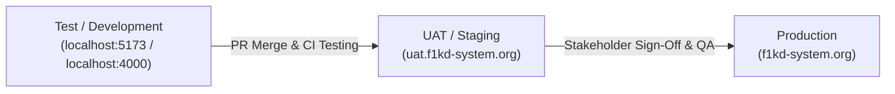

# Section 3.6: Environments Specification

> **Project Name:** First 1,000 Days (F1KD) Maternal & Child Health and Nutrition Monitoring System  
> **Architecture:** Decoupled Single-Page Application (React + Vite) with Express.js REST API and MySQL Database  
> **Document Reference:** Section 3.6 - Environments  
> **Generation Date:** 2026-09-14  

---

## 1. Environment Matrix

### 1.1 For the System (Frontend Web Application)

| Environment | Production | UAT (User Acceptance Testing) | Test / Development |
| :--- | :--- | :--- | :--- |
| **URL / Link** | `https://f1kd-system.org` | `https://uat.f1kd-system.org` | `http://localhost:5173` |
| **Hosting Platform** | Cloud Web Server / Static CDN (e.g., Vercel, Netlify, Nginx) | Staging Web Server / Preview Environment | Local Node.js Development Server (Vite 5) |
| **Protocol** | HTTPS (TLS 1.3) | HTTPS (TLS 1.3) | HTTP |
| **Port** | 443 | 443 | 5173 |

---

### 1.2 For the API (Backend REST API)

| Environment | Production | UAT (User Acceptance Testing) | Test / Development |
| :--- | :--- | :--- | :--- |
| **URL / Link** | `https://api.f1kd-system.org/api` | `https://uat-api.f1kd-system.org/api` | `http://localhost:4000/api` |
| **Runtime / Engine** | Node.js v20 LTS / Express 4 | Node.js v20 LTS / Express 4 | Node.js v20 / Express 4 (Nodemon) |
| **Base Path** | `/api` | `/api` | `/api` |
| **CORS Policy** | Restricted to production frontend origin | Restricted to UAT frontend origin | `http://localhost:5173` (Vite dev proxy enabled) |
| **Port** | 443 (Reverse proxy to internal 4000) | 443 (Reverse proxy to internal 4000) | 4000 |

---

### 1.3 For the Database (Relational DBMS)

| Environment | Production | UAT (User Acceptance Testing) | Test / Development |
| :--- | :--- | :--- | :--- |
| **Connection URI** | `mysql://db.f1kd-system.org:3306/f1kd` | `mysql://uat-db.f1kd-system.org:3306/f1kd_uat` | `mysql://127.0.0.1:3306/f1kd` |
| **DBMS Engine** | MySQL 8.0+ / MariaDB 10.4+ | MySQL 8.0+ / MariaDB 10.4+ | MySQL 8.0 / MariaDB (Local / XAMPP) |
| **Database Name** | `f1kd` | `f1kd_uat` | `f1kd` |
| **Host / IP** | `db.f1kd-system.org` | `uat-db.f1kd-system.org` | `127.0.0.1` (`localhost`) |
| **Default Port** | 3306 | 3306 | 3306 |
| **Storage Engine** | InnoDB | InnoDB | InnoDB |
| **Collation** | `utf8mb4_general_ci` | `utf8mb4_general_ci` | `utf8mb4_general_ci` |

---

## 2. Environment Configuration & Variables

The following environment variables control connectivity and behavior across target environments:

```ini
# Application Server Port
PORT=4000

# Database Connectivity
DB_HOST=127.0.0.1
DB_PORT=3306
DB_USER=root
DB_PASSWORD=
DB_NAME=f1kd

# Security & Authentication
JWT_SECRET=production_jwt_secret_token_change_me
JWT_EXPIRES=8h
REFRESH_TOKEN_TTL=7d

# Default System Administrator
DEFAULT_ADMIN_EMAIL=Superadmin@gmail.com
DEFAULT_ADMIN_PASSWORD=Welcome123!
```

---

## 3. Environment Isolation & Deployment Flow



1. **Development / Test:** Features are implemented locally. The React frontend interacts with the local Express API on port `4000` through Vite's reverse proxy (`/api`).
2. **UAT (User Acceptance Testing):** Deployed for clinic coordinators, municipal nutritionists, and stakeholders to test data entry workflows without affecting production live patient data.
3. **Production:** Hardened production server running behind an SSL-terminated reverse proxy (such as Nginx) with automated daily MySQL backups.
