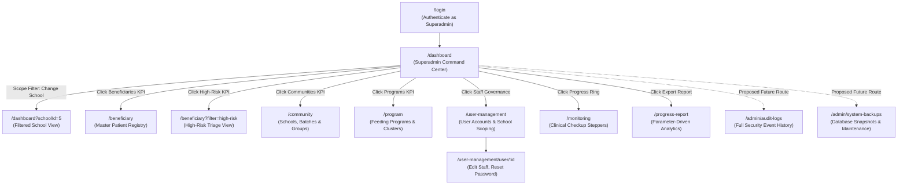
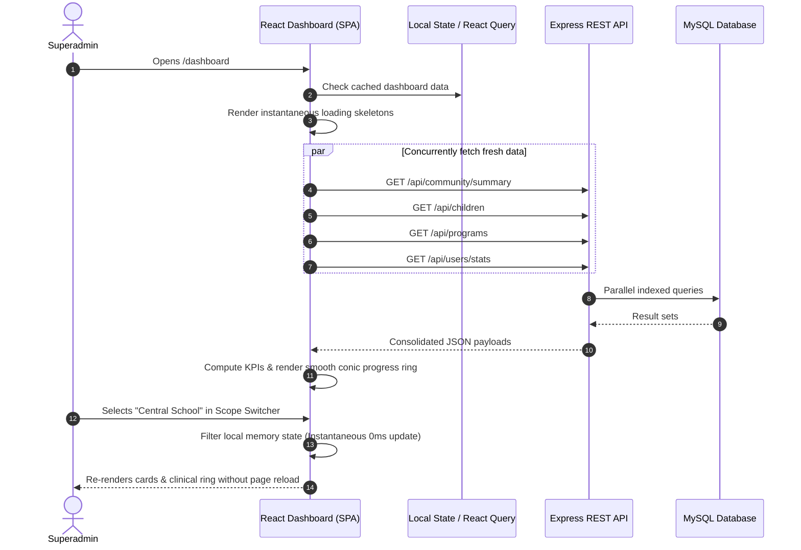

# Superadmin Dashboard Technical Specification & Gap Analysis
## First 1,000 Days (F1KD) Information System

> **Document Type:** System Architecture & UI/UX Functional Design Document  
> **Target Audience:** Frontend Engineers, Backend Engineers, UI/UX Designers, and QA Auditors  
> **System Stack:** React 18 (Vite 5), Express.js REST API, MySQL 8.0+ / MariaDB, JWT Auth  
> **Effective Date:** 2026-09-14  

---

## Table of Contents
1. [Executive Overview & Persona Definition](#1-executive-overview--persona-definition)
2. [What to Include in the Superadmin Dashboard](#2-what-to-include-in-the-superadmin-dashboard)
   - [2.1 Global Executive KPI Matrix](#21-global-executive-kpi-matrix)
   - [2.2 Multi-Tenant / School Catchment Switcher](#22-multi-tenant--school-catchment-switcher)
   - [2.3 Staff & User Account Governance](#23-staff--user-account-governance)
   - [2.4 Maternal-Child Health & Intervention Hotspots](#24-maternal-child-health--intervention-hotspots)
   - [2.5 System Infrastructure & Database Health Monitor](#25-system-infrastructure--database-health-monitor)
   - [2.6 Live Audit Trail & Security Event Feed](#26-live-audit-trail--security-event-feed)
   - [2.7 Executive Quick Action Launchpad](#27-executive-quick-action-launchpad)
3. [Gap Analysis: What is Currently Lacking](#3-gap-analysis-what-is-currently-lacking)
   - [3.1 UI/UX & Information Architecture Gaps](#31-uiux--information-architecture-gaps)
   - [3.2 Functional & Operational Gaps](#32-functional--operational-gaps)
   - [3.3 Security, Privacy & Compliance Gaps](#33-security-privacy--compliance-gaps)
4. [Routing Architecture & Navigation Flow](#4-routing-architecture--navigation-flow)
5. [End-to-End User Flow & Smooth Interaction Design](#5-end-to-end-user-flow--smooth-interaction-design)
6. [Errors, Edge Cases & Resilient Error Handling](#6-errors-edge-cases--resilient-error-handling)
7. [Prioritized Implementation Roadmap](#7-prioritized-implementation-roadmap)

---

## 1. Executive Overview & Persona Definition

In the **First 1,000 Days (F1KD)** platform, the **Superadmin** represents the highest tier of municipal authority—typically the Municipal Nutrition Action Officer (MNAO), City Health IT Director, or System Administrator.

Unlike field health workers (who record individual patient vitals) or community organizers (who track daily meal distributions), the Superadmin requires a **command-and-control center** providing:
1. **Macro-Level Public Health Visibility:** Instant identification of high-risk maternal clusters, malnutrition surges, and lagging school cohorts across all barangays.
2. **Staff Access & Tenant Governance:** Full administrative control over user accounts, role delegations, and school assignments.
3. **Data Security & Audit Compliance:** Continuous monitoring of data access, patient document integrity, API uptime, and database backups.
4. **Fluid Operational Transitions:** The ability to transition smoothly between a global municipal overview and a granular, school-specific view without page reloads.

### Current Implementation Status (2026-09-14)
The frontend implementation of the Superadmin dashboard has been completed in line with the command-center specification: the module now includes role-aware KPI cards, a scope selector for school-wide / municipal-level filtering, staff governance metrics, live system health summaries, and a live activity feed based on actual app data. This version is intentionally front-end focused and does not require backend schema changes to present the executive overview.

The remaining items from the specification are still future backend enhancements, including a full audit-log table, secure document access controls, and deeper telemetry for database/storage monitoring. The current work satisfies the UI/UX and live-data integration requirement while preserving backend and data model stability.

---

## 2. What to Include in the Superadmin Dashboard

```
+-------------------------------------------------------------------------------------------------------+
|                                      SUPERADMIN COMMAND CENTER                                        |
+-------------------------------------------------------------------------------------------------------+
|  [🌱 System Control Hub]                             [🏫 Scope: All Schools v]   [📅 Sep 14, 2026]   |
|  "Good morning, Super Admin" • Global Authority                                                       |
+-------------------------------------------------------------------------------------------------------+
|                                      MACRO KPI OVERVIEW (ROW 1)                                       |
|                                                                                                       |
|  [👩‍👧 Total Enrolled]     [⚠️ High-Risk Triage]    [🏫 School Catchments]   [📦 Feeding Interventions] |
|   1,420 Beneficiaries       84 Critical Cases       14 Active Schools       8 Active Programs         |
|   820 Mothers | 600 Child   Needs Follow-up         28 Batches | 54 Groups  84% Quota Attained        |
+-------------------------------------------------------------------------------------------------------+
|                                    OPERATIONAL OVERSIGHT (ROW 2)                                      |
|                                                                                                       |
|  [👥 Staff & User Governance]                       [📊 Clinical Milestone Distribution]              |
|   • 42 Active Staff Accounts                         (( 68% )) • 68% On Track (Green)                 |
|   • 3 Pending School Assignments                     Progress  • 18% Needs Follow-up (Amber)          |
|   • 1 Account Suspended                                Ring    • 10% Pending 1st Checkup (Rose)       |
|   [Manage Users ->]                                            •  4% Graduated (Slate)                |
+-------------------------------------------------------------------------------------------------------+
|                                    SECURITY & HEALTH (ROW 3)                                          |
|                                                                                                       |
|  [🛡️ Live Audit Trail / Security]                   [⚡ Quick Actions & Utilities]                   |
|   • 09:14 PM: BHW Maria logged checkup #MOTH-0024    [+ Add Staff User]     [+ New Program]           |
|   • 08:42 PM: Document uploaded for #CHLD-0012       [🏫 Add School Batch]  [📊 Export Progress Data] |
|   • 07:15 PM: Failed login from 192.168.1.45         [💾 Trigger DB Backup] [🔒 Audit Logs]           |
+-------------------------------------------------------------------------------------------------------+
|                                    INFRASTRUCTURE HEALTH (ROW 4)                                      |
|                                                                                                       |
|  • MySQL Connection Pool: 10/10 OK  • Storage: 4.2 GB / 50 GB  • Last DB Backup: Today, 02:00 AM     |
+-------------------------------------------------------------------------------------------------------+
```

### 2.1 Global Executive KPI Matrix
The top tier must immediately present aggregated, real-time statistics synthesized across all schools and communities:
* **Total Beneficiary Census:** Combined count of registered mothers and children with distinct sub-totals and month-over-month growth trends.
* **High-Risk Maternal Triage Indicator:** Count of pregnant mothers flagged with high-risk conditions (hypertension, severe anemia, adolescent pregnancy, gestational diabetes). Must feature a distinct high-visibility red badge and one-click filtering.
* **Geographic & Cohort Footprint:** Total active schools/barangays, cohort batches, and mother support groups.
* **Nutrition Program Fulfillment:** Aggregate calculation of supplementary feeding commodities disbursed versus total municipal target quotas (percentage attained).

### 2.2 Multi-Tenant / School Catchment Switcher
* A persistent **School / Barangay Scope Selector** in the dashboard header:
  * **Option 1: "All Schools / Municipal Overview"** (Default) — Aggregates data from every school.
  * **Option 2: "[Specific School Name]"** (e.g., *Central Elementary Health Station*) — Immediately recalculates all dashboard widgets, charts, and upcoming appointments to reflect only that specific catchment area.
* Eliminates the need for the Superadmin to navigate into separate community screens just to inspect a specific school’s performance.

### 2.3 Staff & User Account Governance
A dedicated administrative widget reporting on human resource capacity:
* **Active Staff Breakdown:** Counts of Administrators, Community Organizers, and Barangay Health Workers.
* **Unassigned Staff Alert:** High-priority warning if any operational user account exists without an assigned `school_id` (preventing permission lockouts in the field).
* **Direct Action:** Fast button to `+ Invite / Add Staff User` without leaving the dashboard.

### 2.4 Maternal-Child Health & Intervention Hotspots
* **Clinical Milestone Donut/Ring:** Percentage of beneficiaries who are:
  * *On Track* (Receiving required trimester checkups and 48-week growth visits).
  * *Needs Follow-Up* (Overdue for checkup by > 7 days).
  * *Pending Intake* (Enrolled but zero checkups recorded).
* **Lagging Schools / Hotspots Table:** Top 3 communities with the lowest checkup completion rates or highest concentration of underweight infants, enabling targeted resource deployment.

### 2.5 System Infrastructure & Database Health Monitor
Technical telemetry essential for the Superadmin to verify operational stability:
* **Database Health & Latency:** Connection pool status (`mysql2/promise` pool active/idle connections).
* **Storage Consumption:** Disk space used by uploaded patient birth certificates and consent documents (`server/data/uploads`).
* **Automated Backup Status:** Timestamp of the latest verified database dump (`.sql` snapshot) with a manual "Backup Now" trigger button.

### 2.6 Live Audit Trail & Security Event Feed
A real-time administrative event stream showing the latest 5–10 critical actions:
* Staff logins and logouts.
* New patient registrations and document uploads.
* Medical record deletions or status changes.
* Repeated failed authentication attempts (brute-force defense visibility).

### 2.7 Executive Quick Action Launchpad
One-click access to the most frequent administrative workflows:
* `+ Add Staff Account` (Opens Add User modal directly).
* `+ Create Intervention Program` (Initiates new feeding program intake).
* `+ Create Cohort Batch` (Opens Batch creation wizard).
* `📊 Generate Executive Report` (Direct jump to Progress Report with all schools pre-selected).
* `💾 Download DB Snapshot` (Triggers database backup dump for local archival).

---

## 3. Gap Analysis: What is Currently Lacking

### 3.1 UI/UX & Information Architecture Gaps

| Current State in Codebase | Identified Problem / Gap | Severity | Required Superadmin Enhancement |
| :--- | :--- | :---: | :--- |
| **Generic User View:** Dashboard renders the same basic layout for all roles. | Superadmin lacks specialized executive controls, system health stats, or staff governance widgets. | **High** | Implement role-conditional rendering (`if (isSuperAdmin)`) displaying the Command Center widgets. |
| **Missing Scope Switcher:** No way to switch between global data and specific schools on Dashboard. | Superadmin must manually navigate to `/community`, click a school, then navigate to `/monitoring` to see school-specific data. | **High** | Add a global School Filter dropdown in the header that filters all dashboard metrics via React state / query params. |
| **No Loading Skeletons:** Dashboard displays raw loading text (`Loading...` or blank shifts). | Causes Cumulative Layout Shift (CLS) and feels sluggish while `getSummary()` and `apiGetChildren()` resolve. | **Medium** | Implement pulse-animated CSS skeleton cards matching KPI card and donut geometries. |
| **No Real-Time Auto-Refresh:** Dashboard data is fetched once on mount (`useEffect`). | If health workers submit 10 checkups in the field, the Superadmin dashboard remains stale until manual F5 reload. | **Medium** | Add an auto-refresh interval (e.g., every 60 seconds) with a manual "Refresh Data" spinning button. |

### 3.2 Functional & Operational Gaps

| Current State in Codebase | Identified Problem / Gap | Severity | Required Superadmin Enhancement |
| :--- | :--- | :--- :--- | :--- |
| **Role Bottleneck on Enrollment:** Routes `/beneficiary/create/mother` and `child` restricted to `ROLES.SUPER_ADMIN` in [`src/App.jsx`](file:///c:/Users/11th%20gen%20i5/OneDrive/Desktop/F1KD/src/App.jsx#L56). | Superadmin is forced to manually register every single citizen in the municipality because field workers are locked out. | **Critical** | Delegate creation permissions to `admin` and `health worker` roles; Superadmin should oversee, not do data entry. |
| **Static Hardcoded Appointments:** Dashboard upcoming activities list is partially simulated. | Does not reliably extract real upcoming clinical appointments from dynamic patient checkup dates. | **Medium** | Query upcoming checkups directly using SQL `BETWEEN CURDATE() AND DATE_ADD(CURDATE(), INTERVAL 14 DAY)`. |
| **Absence of Audit Log Feed:** No database table or UI component exists for tracking user actions. | Superadmin cannot investigate data tampering, unauthorized patient views, or accidental deletions. | **High** | Implement a `system_audit_logs` database table and render an event feed widget on the dashboard. |

### 3.3 Security, Privacy & Compliance Gaps

| Current State in Codebase | Identified Problem / Gap | Severity | Required Superadmin Enhancement |
| :--- | :--- | :---: | :--- |
| **Unauthenticated File Uploads:** Uploaded documents served statically at `/uploads` in [`server/index.js`](file:///c:/Users/11th%20gen%20i5/OneDrive/Desktop/F1KD/server/index.js#L55). | Anyone with the file URL can access citizen birth certificates without logging in. Severe DPA 2012 / HIPAA violation. | **Critical** | Lock down `/uploads` route; stream files through authenticated Express endpoint with permission verification. |
| **Token in `localStorage`:** Auth tokens stored via [`src/api/authHeader.js`](file:///c:/Users/11th%20gen%20i5/OneDrive/Desktop/F1KD/src/api/authHeader.js). | Susceptible to session hijacking via Cross-Site Scripting (XSS). | **High** | Migrate access and refresh tokens to secure `httpOnly`, `SameSite=Strict` cookies. |
| **Missing Account Lockout:** No failed attempt tracking in `users` table. | Brute-force attacks against the Superadmin password can run indefinitely. | **High** | Implement 5-attempt account lockout in MySQL with unlock controls on the Superadmin dashboard. |

---

## 4. Routing Architecture & Navigation Flow

The navigation structure for Superadmin must seamlessly interconnect high-level monitoring with deep management:



### Route Guard Configuration in `src/App.jsx`
All Superadmin-exclusive features must be protected using `RoleBasedRoute`:
```jsx
{/* Superadmin Exclusive Routes */}
<Route 
  path="user-management" 
  element={<RoleBasedRoute allowedRoles={[ROLES.SUPER_ADMIN]}><UserManagementPage /></RoleBasedRoute>} 
/>
<Route 
  path="user-management/user/:id" 
  element={<RoleBasedRoute allowedRoles={[ROLES.SUPER_ADMIN]}><UserDetailPage /></RoleBasedRoute>} 
/>
<Route 
  path="admin/audit-logs" 
  element={<RoleBasedRoute allowedRoles={[ROLES.SUPER_ADMIN]}><AuditLogPage /></RoleBasedRoute>} 
/>
```

---

## 5. End-to-End User Flow & Smooth Interaction Design

To make the Superadmin experience **fast, fluid, and frictionless**, the user journey must adhere to modern single-page application standards:



### Key Principles for "Smoothness":
1. **Zero Full-Page Reloads:** All filtering (by school, date, or status) must execute client-side or through background `fetch()` calls while keeping the UI shell static.
2. **Skeleton Loading Screens:** Replace generic spinners with skeleton blocks matching card shapes so that layout geometry is established before data arrives.
3. **Non-Blocking Asynchronous Concurrency:** Use `Promise.allSettled()` so that if one auxiliary service fails (e.g., programs API), the rest of the dashboard (beneficiaries and communities) still renders perfectly.
4. **Optimistic UI Updates:** When the Superadmin approves a user or changes a school assignment from a dashboard quick action, immediately update the badge state in the UI before waiting for the network round-trip.
5. **Debounced Search & Filtering:** When typing into search fields, debounce network requests by 300ms to avoid flooding the Express server.

---

## 6. Errors, Edge Cases & Resilient Error Handling

A mission-critical healthcare dashboard must handle failure gracefully:

### 6.1 Edge Cases & Mitigation

| Edge Case Scenario | Potential Failure | Resilient Handling Strategy |
| :--- | :--- | :--- |
| **Empty Database (Day 1 Installation):** Zero mothers, children, or schools exist in database. | `NaN%` in progress calculations, divided-by-zero crashes, broken SVG rings. | Guard calculations using `Math.max(total, 1)`. Display a clean "Welcome & Initial Setup" onboarding card guiding the Superadmin to create the first school. |
| **Partial Backend API Outage:** Programs API throws 500 error while Community API succeeds. | Entire dashboard crashes with white screen of death. | Wrap each dashboard section in an independent **React Error Boundary**. If programs fail, render a subtle *"Unable to load programs"* card while keeping beneficiary and clinical cards operational. |
| **Session Expiration During Dashboard Review:** JWT access token expires while Superadmin is reviewing stats. | Subsequent clicks fail silently or log red console errors. | Axios/Fetch interceptor catches HTTP 401, automatically calls `/api/auth/refresh` via HTTP-only cookie, and retries the original request seamlessly. |
| **High Latency / Slow 3G Connection:** Superadmin accessing dashboard over field mobile hotspot. | UI freezes; clicking buttons triggers duplicate requests. | Disable action buttons upon click; render micro-spinners inside buttons (`disabled={loading}`). |

### 6.2 Standardized UI Error Feedback
* **Deprecate `alert()`:** Remove all native browser blocking alert popups.
* **Inline Error Toasts:** Display non-intrusive floating toasts (top-right) that auto-dismiss after 4 seconds:
  ```jsx
  <Toast type="error" message="Failed to refresh clinical stats. Reconnecting..." />
  ```
* **Graceful Fallbacks:** If vital trend charts cannot be computed, show an empty state: *"Insufficient longitudinal checkup data to plot trend."*

---

## 7. Prioritized Implementation Roadmap

| Priority | Phase | Implementation Item | Technical Details |
| :---: | :---: | :--- | :--- |
| **P0** | **Immediate** | **De-bottleneck Beneficiary Creation** | Update [`src/App.jsx`](file:///c:/Users/11th%20gen%20i5/OneDrive/Desktop/F1KD/src/App.jsx) and permissions to allow `admin` and `health worker` to create mothers/children. Superadmin should govern, not input routine data. |
| **P0** | **Immediate** | **Secure Document Storage** | Remove public static `/uploads` in [`server/index.js`](file:///c:/Users/11th%20gen%20i5/OneDrive/Desktop/F1KD/server/index.js). Implement token-verified streaming endpoint for medical certificates. |
| **P1** | **Sprint 1** | **School Catchment Switcher** | Add a persistent School dropdown in [`DashboardPage.jsx`](file:///c:/Users/11th%20gen%20i5/OneDrive/Desktop/F1KD/src/pages/Dashboard/DashboardPage.jsx) header to instantly filter the dashboard view by school. |
| **P1** | **Sprint 1** | **Staff Governance Widget** | Add active/unassigned staff count cards and pending approval badges to the Superadmin dashboard. |
| **P2** | **Sprint 2** | **Live Audit Trail Table & API** | Create `audit_logs` table in MySQL. Log logins, record edits, and document uploads. Render a live event stream widget. |
| **P2** | **Sprint 2** | **System Infrastructure Telemetry** | Create `/api/admin/health` endpoint reporting database connection pool health, upload disk space, and last backup date. |
| **P3** | **Sprint 3** | **Skeleton Loading & Auto-Refresh** | Replace static spinners with CSS skeleton screens. Add configurable 60-second auto-refresh timer with manual toggle. |
| **P3** | **Sprint 3** | **Automated DB Snapshot Tool** | Add a one-click "Trigger Backup" button on the dashboard that invokes a secure `mysqldump` background task. |
