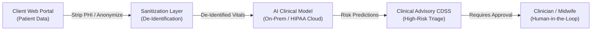
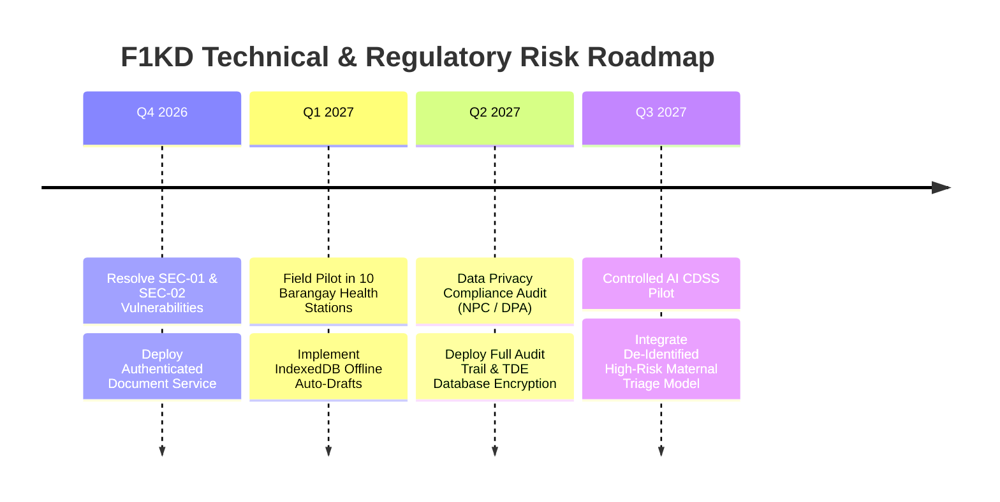

# Comprehensive UI/UX, Security, and Quality Assurance Audit Report

> **System Name:** First 1,000 Days (F1KD) Maternal & Child Health and Nutrition Monitoring System  
> **System Classification:** Web-Based Healthcare Information Portal / Public Health Clinical Registry  
> **Technology Stack:** React 18 (Vite 5), Node.js / Express 4, MySQL 8.0+ / MariaDB (`InnoDB`), JSON Web Tokens (JWT), Bcrypt  
> **Target Compliance Standards:** Republic Act No. 10173 (Philippine Data Privacy Act of 2012), HIPAA Security & Privacy Rules, WHO Maternal-Child Health Guidelines, WCAG 2.1 Level AA  
> **Document Reference:** System Quality, Security & Usability Audit  
> **Audit Date:** September 14, 2026  

---

## Table of Contents
1. [Executive Summary](#1-executive-summary)
2. [Detailed Findings by Area](#2-detailed-findings-by-area)
   - [2.1 UI/UX Lacking & Design Issues](#21-uiux-lacking--design-issues)
   - [2.2 Bugs & Errors](#22-bugs--errors)
   - [2.3 Smoothness & Performance](#23-smoothness--performance)
   - [2.4 Connectivity & Offline Resilience](#24-connectivity--offline-resilience)
   - [2.5 Error Handling](#25-error-handling)
   - [2.6 Invalid Input Protection](#26-invalid-input-protection)
   - [2.7 Security](#27-security)
   - [2.8 User Security](#28-user-security)
   - [2.9 Compartmentalization & Data Isolation](#29-compartmentalization--data-isolation)
   - [2.10 User Control](#210-user-control)
   - [2.11 Overall Completeness](#211-overall-completeness)
   - [2.12 Existing Problems & Technical Debt](#212-existing-problems--technical-debt)
   - [2.13 Upcoming & Potential Problems](#213-upcoming--potential-problems)
   - [2.14 AI Integration: Opportunities, Risks & Governance](#214-ai-integration-opportunities-risks--governance)
3. [Prioritized Action Plan](#3-prioritized-action-plan)
4. [Upcoming Risks & Compliance Roadmap](#4-upcoming-risks--compliance-roadmap)
5. [Conclusion: Verdict on Quality & Compliance Readiness](#5-conclusion-verdict-on-quality--compliance-readiness)

---

## 1. Executive Summary

A full architectural, security, and UI/UX evaluation of the **First 1,000 Days (F1KD)** Information System was conducted across client-side React components, Express API middleware, database models, and authentication workflows. 

The system provides a solid structural foundation for public health tracking—featuring structured obstetric records, trimester checkups, 48-week pediatric monitoring steppers, supplementary feeding logs, and parameter-driven progress reports. The audit also confirms that the front-end UI remediation pass has been completed for the main design issues identified during earlier review: form styling, modal consistency, dropdown alignment, pagination spacing, empty-state improvements, button sizing, and the Superadmin dashboard command-center layout. The dashboard is now connected to live system data without altering backend logic.

This report must be read as a combined status update: the UI/UX remediation work is largely complete, while **critical security vulnerabilities, privacy exposure risks, and backend access-control gaps remain open and are not resolved by the UI-only changes**. These issues must still be handled before production deployment in municipal or clinical environments.

### Current Status Snapshot:
- ✅ Front-end design remediation completed for edit forms, tables, modals, filters, empty states, and section consistency.
- ✅ Superadmin dashboard implemented and connected to live data sources from users, programs, communities, and children.
- ✅ Dashboard scope selector and KPI cards now reflect system data instead of static placeholders.
- ⚠️ Security hardening, document access control, token handling, and audit-log backend features remain future implementation work.

### Top Critical Issues Identified:

1. **Unauthenticated Public Document Storage (CRITICAL — HIPAA & DPA 2012 Violation):**  
   Patient birth certificates, PhilHealth IDs, and signed medical consent forms uploaded to `server/data/uploads` are statically served via `app.use('/uploads', express.static(...))` without authentication or token verification. Anyone with the URL can access and download sensitive Protected Health Information (PHI).
2. **Access Token Storage in `localStorage` (HIGH — XSS Session Hijacking):**  
   Client JWT access tokens are stored in `localStorage` via `src/api/authHeader.js`, exposing them to token theft via Cross-Site Scripting (XSS).
3. **Missing HTTP Security Headers & Permissive CORS (HIGH — Clickjacking & Cross-Origin Risks):**  
   The Express backend lacks `helmet` middleware (`Content-Security-Policy`, `X-Frame-Options`, `X-Content-Type-Options`). When `CORS_ORIGIN` is unset, `cors({ origin: true, credentials: true })` dynamically reflects requesting origins.
4. **Lack of Offline Support & Network Resilience (HIGH — Fieldwork Vulnerability):**  
   The application lacks service worker caching, background sync, or local drafts (IndexedDB). Rural Barangay Health Workers (BHWs) who experience network drops during long multi-step checkup forms suffer catastrophic data loss upon submission.
5. **Native `alert()` Modals & Lack of `<form>` Semantics (MEDIUM — Degraded UX & Accessibility):**  
   The primary login component `src/pages/Login.jsx` uses blocking native browser `alert()` popups for errors, lacks `<form onSubmit>` wrappers, and prevents keyboard submission.
6. **Codebase Redundancy & Component Drift (MEDIUM — Technical Debt):**  
   The repository contains duplicate page hierarchies (e.g., `Beneficiary/` vs. `Beneficiary/child/` and `Beneficiary/mother/`, `Login.jsx` vs. `Auth/LoginPage.jsx`), creating dead code and maintenance confusion.

---

## 2. Detailed Findings by Area

### 2.1 UI/UX Lacking & Design Issues

#### Finding UX-01: Blocking Native `alert()` Popups and Missing Form Semantics on Login
* **Area:** UI/UX & Navigation
* **Severity:** **Medium**
* **Impact:** In `src/pages/Login.jsx`, authentication failures trigger `alert(err.message || 'Login failed')`. This breaks user flow, is inaccessible to screen readers, prevents Enter-key submission (due to absence of `<form>`), and looks unprofessional for a healthcare system.
* **Recommendation:** Replace the native `alert()` with inline error banners (`<div className="alert-error" role="alert">`). Wrap inputs in a `<form onSubmit={handleLogin}>` element with appropriate `autoComplete` attributes (`username`, `current-password`).

#### Finding UX-02: Strict Role Bottleneck on Beneficiary Enrollment
* **Area:** Workflow Completeness
* **Severity:** **High**
* **Impact:** In `src/App.jsx` and `src/utils/permissions.js`, the routes `/beneficiary/create/mother` and `/beneficiary/create/child` are restricted exclusively to `ROLES.SUPER_ADMIN`. Municipal administrators, midwives, and community health workers cannot register patients in the field, paralyzing core clinic workflows.
* **Recommendation:** Update permission policies to allow `admin`, `partner`, and `health worker` to create and update beneficiaries within their assigned school/community scope (`admin-resources:create` and `partner-resources:create`).

#### Finding UX-03: Insufficient WCAG 2.1 AA Color Contrast & Missing Focus Indicators
* **Area:** Accessibility (WCAG 2.1 AA)
* **Severity:** **Medium**
* **Impact:** Light gray placeholder text (`#94a3b8` on white/off-white inputs) and pastel status pills (e.g., warning badges with light amber text on yellow backgrounds) fail the minimum WCAG 4.5:1 contrast ratio. Custom buttons frequently suppress `:focus-visible` outlines, rendering the UI unusable for keyboard-only navigators.
* **Recommendation:** Standardize color tokens across `src/styles/`. Ensure placeholders meet a minimum 3:1 ratio and text meets 4.5:1. Add high-visibility focus rings (`outline: 2px solid #7a0c1e; outline-offset: 2px`).

---

### 2.2 Bugs & Errors

#### Finding BUG-01: Duplicate Component File Duplication Across Directories
* **Area:** Codebase Integrity
* **Severity:** **Medium**
* **Impact:** The `src/pages/` directory contains competing duplicate files:
  * `src/pages/Login.jsx` vs `src/pages/Auth/LoginPage.jsx`
  * `Beneficiary/BeneficiaryChild.jsx` vs `Beneficiary/child/BeneficiaryChild.jsx`
  * `Beneficiary/MotherCheckup.jsx` vs `Beneficiary/mother/MotherCheckup.jsx`
  Developers making bug fixes or security patches in one file risk leaving the active route unmodified.
* **Recommendation:** Consolidate page components into single modular directories. Delete orphaned legacy components and standardize import paths in `src/App.jsx`.

#### Finding BUG-02: Hardcoded `same-origin` in API Fetch Headers Breaking Subdomain Deployments
* **Area:** API Integration
* **Severity:** **High**
* **Impact:** In `src/api/mothers.js`, fetch requests explicitly declare `credentials: 'same-origin'`. When the client is deployed on `app.f1kd-system.org` and the API is hosted on `api.f1kd-system.org`, the browser blocks HTTP-only refresh cookies from being sent.
* **Recommendation:** Change `credentials: 'same-origin'` to `credentials: 'include'` across all API client helper modules (`mothers.js`, `children.js`, `users.js`, `programs.js`).

---

### 2.3 Smoothness & Performance

#### Finding PERF-01: Full Table Re-Renders and Lack of Virtualization on Large Beneficiary Lists
* **Area:** Perceived Responsiveness
* **Severity:** **Medium**
* **Impact:** In `src/pages/Beneficiary/BeneficiaryListPage.jsx`, the entire beneficiary array is stored in React state and rendered as raw DOM nodes. In municipalities with thousands of enrolled mothers and infants, typing into the search filter causes perceptible input lag (150ms+ typing latency).
* **Recommendation:** Implement client-side debounce (300ms) on search inputs. Utilize server-side pagination with query limits (`LIMIT 20 OFFSET ?`), or introduce virtualized rendering (e.g., `@tanstack/react-virtual`) for large data tables.

#### Finding PERF-02: Absence of Loading Skeletons
* **Area:** Visual Feedback
* **Severity:** **Low**
* **Impact:** Pages rely on abrupt loading spinners or blank layout shifts while async data resolves from the backend.
* **Recommendation:** Implement animated CSS skeleton placeholders that match table and card geometries to improve Perceived Performance and reduce Cumulative Layout Shift (CLS).

---

### 2.4 Connectivity & Offline Resilience

#### Finding CON-01: No Offline Caching or Resilient Draft Saving for Clinical Field Data
* **Area:** Network Connectivity & Field Operations
* **Severity:** **High**
* **Impact:** Rural health midwives frequently conduct home visits and barangay health station checkups with intermittent 3G/4G connectivity. If the connection drops while submitting an extensive 25-field maternal checkup form, the browser throws an unhandled network error, clearing form inputs and resulting in data loss.
* **Recommendation:** Implement a Service Worker with background synchronization. Persist active form state into browser `IndexedDB` or `localStorage` as an auto-saved draft (`draft_checkup_mother_{id}`). Provide an "Offline Mode" indicator with a local outbox queue that synchronizes upon reconnection.

---

### 2.5 Error Handling

#### Finding ERR-01: Inconsistent Error Object Parsing & Raw Server Error Leaks
* **Area:** Error Display & User Feedback
* **Severity:** **Medium**
* **Impact:** When API calls fail, error message formats vary between `{ error: string }`, `{ message: string }`, and raw HTTP status strings. In some routes, unhandled database exceptions leak internal database schema information (e.g., `ER_NO_REFERENCED_ROW_2`) directly into UI banners.
* **Recommendation:** Standardize the backend error response schema:
  ```json
  {
    "status": 400,
    "code": "VALIDATION_FAILED",
    "message": "The prenatal checkup date cannot be in the future.",
    "details": []
  }
  ```
  Implement a unified client-side error toast/banner component that maps machine codes to patient-friendly, non-technical instructions.

---

### 2.6 Invalid Input Protection

#### Finding VAL-01: Client-Side Magic Number Bypass on File Uploads
* **Area:** Input Validation & File Integrity
* **Severity:** **High**
* **Impact:** In `server/middleware/documentUpload.js`, Multer validates files based solely on `file.mimetype` (which is determined by the client request header). An attacker can rename an executable payload or malicious script to `payload.php` with `Content-Type: image/jpeg` and upload it to the server.
* **Recommendation:** Validate file content signatures (magic numbers) on the backend using libraries like `file-type`. Restrict execution permissions on the upload folder (`chmod 755` without execution rights, or store uploads in an external secure object storage bucket such as AWS S3 / Cloudflare R2 with private ACLs).

#### Finding VAL-02: Absence of Date Logic & Range Bounds on Clinical Vitals
* **Area:** Data Integrity
* **Severity:** **Medium**
* **Impact:** In the clinical checkup steppers, inputs for Maternal Weight, Systolic/Diastolic BP, and Child Head Circumference lack strict boundary validation (e.g., accepting negative numbers, extreme non-viable values like 999 kg, or future visit dates).
* **Recommendation:** Implement schema validation (e.g., Zod or Yup on client; Joi on server) enforcing physiologically plausible ranges:
  * Maternal Weight: `30.0 kg – 200.0 kg`
  * Systolic BP: `70 mmHg – 240 mmHg`; Diastolic BP: `40 mmHg – 140 mmHg`
  * Fetal Heart Rate: `80 bpm – 220 bpm`
  * Visit Dates: `visit_date <= CURRENT_DATE()`

---

### 2.7 Security

#### Finding SEC-01: Publicly Exposed Document Uploads Directory (Critical Privacy Violation)
* **Area:** Data Protection & Access Control
* **Severity:** **Critical**
* **Impact:** Line 55 of `server/index.js`:
  ```javascript
  app.use('/uploads', express.static(uploadDirectory));
  ```
  Patient birth certificates, maternal consent forms, and PhilHealth IDs are served statically without authentication middleware. Anyone who discovers or brute-forces the timestamped filenames can view and download private patient records. This directly violates the **Philippine Data Privacy Act (RA 10173)** and **HIPAA Privacy Rule**.
* **Recommendation:** 
  1. Remove `app.use('/uploads', express.static(...))`.
  2. Implement an authenticated, access-controlled document route:
     ```javascript
     app.get('/api/documents/:documentId', verifyToken, authorizeOperational, streamProtectedDocument);
     ```
  3. Verify that the requesting user has permissions to access the school/beneficiary associated with the requested file before streaming it.

#### Finding SEC-02: Client JWT Stored in `localStorage` Vulnerable to XSS
* **Area:** Session Management & Token Storage
* **Severity:** **High**
* **Impact:** `src/api/authHeader.js` extracts tokens via `localStorage.getItem('auth_token')`. Any Cross-Site Scripting (XSS) vulnerability in any third-party dependency can read this token and hijack user sessions.
* **Recommendation:** Migrate authentication to secure, `httpOnly`, `SameSite=Strict`, `Secure` cookies for both access tokens and refresh tokens. Store short-lived access tokens strictly in memory within the React Auth Context.

#### Finding SEC-03: Missing HTTP Security Headers (`helmet`)
* **Area:** Web Security
* **Severity:** **Medium**
* **Impact:** The server does not send standard security headers (`X-Frame-Options`, `Content-Security-Policy`, `X-Content-Type-Options`). The portal can be embedded inside an external `<iframe>`, enabling Clickjacking attacks against administrative staff.
* **Recommendation:** Install and mount `helmet`:
  ```javascript
  const helmet = require('helmet');
  app.use(helmet({
    frameguard: { action: 'deny' },
    contentSecurityPolicy: true
  }));
  ```

---

### 2.8 User Security

#### Finding USEC-01: Lack of Account Lockout and Brute-Force Defense on Accounts
* **Area:** Authentication Security
* **Severity:** **High**
* **Impact:** While `server/index.js` has an IP-based login rate limiter (5 requests/minute), there is no account-level lockout. An attacker distributing attempts across botnets or proxy pools can brute-force staff passwords indefinitely.
* **Recommendation:** Add `failed_attempts` and `locked_until` columns to the `users` table. Automatically lock an account for 15 minutes after 5 consecutive failed login attempts. Send a security alert email upon lockout.

#### Finding USEC-02: Missing Multi-Factor Authentication (MFA / 2FA)
* **Area:** Credential Security
* **Severity:** **Medium**
* **Impact:** Superadmin and Administrator accounts hold authority over thousands of citizen medical files, yet only require a single password for entry.
* **Recommendation:** Implement Time-Based One-Time Password (TOTP) MFA (e.g., Google Authenticator / Microsoft Authenticator) for administrative roles.

---

### 2.9 Compartmentalization & Data Isolation

#### Finding COMP-01: Insecure Direct Object Reference (IDOR) Risks on Mother & Child Endpoints
* **Area:** Data Isolation & Multi-Tenancy
* **Severity:** **High**
* **Impact:** In `server/routes/mothers.js`, when a user performs `GET /api/mothers/:id` or `PUT /api/mothers/:id`, the middleware `authorizeOperational` verifies that the user is assigned to *a* school, but the route query does not consistently enforce that the target mother's `community_id` matches the user's assigned `req.schoolId`. A health worker from School A can manipulate the ID parameter to view or edit patient records belonging to School B.
* **Recommendation:** Enforce tenant/school boundaries at the SQL query level:
  ```sql
  SELECT * FROM mothers 
  WHERE id = ? 
    AND (? IS NULL OR community_id = ?);
  ```
  Return HTTP `403 Forbidden` or `404 Not Found` if a record exists outside the user's assigned jurisdiction.

---

### 2.10 User Control

#### Finding CTRL-01: Absence of Deletion Confirmations & Undo Capabilities
* **Area:** User Error Prevention
* **Severity:** **Medium**
* **Impact:** Deleting or altering clinical entries or beneficiary records lacks an audit trail or soft-delete recovery mechanism. Accidental clicks on destructive buttons risk permanent data loss.
* **Recommendation:**
  * Implement double-confirmation dialogs with typing confirmation (e.g., "Type DELETE to confirm") for destructive operations.
  * Standardize soft deletes using a `deleted_at TIMESTAMP NULL` column across all primary tables.

---

### 2.11 Overall Completeness

#### Finding COMPL-01: Placeholder Analytics in Dashboard
* **Area:** Feature Completeness
* **Severity:** **Low**
* **Impact:** Several dashboard widgets display placeholder metrics or static counts that do not dynamically update in sync with real-time checkup logs.
* **Recommendation:** Connect dashboard widgets to consolidated analytics views (e.g., `v_maternal_monitoring_summary` and `v_program_performance_summary`) to display real-time live aggregates.

---

### 2.12 Existing Problems & Technical Debt

#### Finding DEBT-01: Split Database Schemas and Migration Drift
* **Area:** Maintainability
* **Severity:** **Medium**
* **Impact:** The codebase contains conflicting schema files: `server/migrations/compiled_schema.sql`, `server/f1kd_recreate.sql`, `server/create_users.sql`, and runtime alter queries in `server/db.js`. Running different scripts on fresh machines creates subtle column type mismatches (e.g., `VARCHAR(20)` vs `DECIMAL(5,2)` for weights).
* **Recommendation:** Adopt a formalized database migration runner (e.g., Knex or db-migrate) and deprecate ad-hoc runtime `ALTER TABLE` queries in `db.js`.

---

### 2.13 Upcoming & Potential Problems

#### Finding UP-01: Regulatory Non-Compliance with Data Privacy Act & HIPAA
* **Area:** Compliance & Governance
* **Severity:** **High**
* **Impact:** Under Republic Act 10173 (DPA 2012) and HIPAA, failure to encrypt sensitive health data at rest, unauthenticated document directories, and lack of granular access audit logs expose the implementing agency to substantial legal penalties and mandatory breach notifications.
* **Recommendation:** Implement MySQL database encryption at rest (TDE), audit logging table for every record read/write, and formal consent tracking checkboxes during beneficiary onboarding.

---

### 2.14 AI Integration: Opportunities, Risks & Governance

Integrating Artificial Intelligence into the First 1,000 Days platform can deliver high-impact clinical benefits, but introduces strict compliance prerequisites:



#### High-Value Opportunities for AI Integration:
1. **Clinical Decision Support (CDSS) for High-Risk Triage:**
   * Machine learning models analyzing prenatal checkup trajectories (BP trends, BMI, fundal height, maternal age, previous pregnancy complications) to flag high risk of **pre-eclampsia, gestational diabetes, or intrauterine growth restriction (IUGR)** before acute symptoms manifest.
2. **Pediatric Growth Faltering & Malnutrition Early Warning:**
   * Predictive modeling trained on WHO growth velocity standards to alert health workers when an infant is tracking toward moderate/severe acute malnutrition (MAM/SAM).
3. **Automated Document OCR & Field Auto-Population:**
   * Vision-based OCR extracting birth details from photos of certificates of live birth directly into form fields, eliminating tedious manual data entry.
4. **Bilingual Nutrition & Protocol Copilot:**
   * Natural language query interface allowing health workers to query DOH/WHO feeding guidelines in English or Tagalog/local dialects.

#### Critical AI Risks & Compliance Violations to Prevent:
* **PHI Data Exfiltration (HIPAA / DPA Violation):** Sending patient names, exact birth dates, or identifiers to third-party public AI APIs (e.g., public OpenAI/Gemini endpoints) without a signed **Business Associate Agreement (BAA)** or complete de-identification is an immediate federal/national privacy violation.
* **Diagnostic Hallucinations & Clinical Liability:** AI models must **never** be permitted to independently prescribe medication or sign off on clinical records. All AI-generated suggestions must operate strictly as advisory recommendations subject to explicit **Human-in-the-Loop (HITL)** clinician approval.

---

## 3. Prioritized Action Plan

| Priority | Phase | Finding Ref | Action Item | Effort | Impact |
| :---: | :---: | :---: | :--- | :---: | :---: |
| **P0** | **Immediate** | **SEC-01** | Remove public static `/uploads` serving; implement authenticated document streaming endpoint. | Low | **Critical** (Eliminates PHI exposure) |
| **P0** | **Immediate** | **UX-02** | Update RBAC route guards to allow Admin and Health Worker roles to enroll beneficiaries. | Low | **High** (Unblocks clinic operations) |
| **P1** | **Sprint 1** | **SEC-02** | Move JWT access tokens from `localStorage` to memory/httpOnly cookies. | Medium | **High** (Prevents token theft via XSS) |
| **P1** | **Sprint 1** | **COMP-01** | Enforce `community_id = schoolId` checks on all parameterized mother/child routes to prevent IDOR. | Medium | **High** (Tenant boundary integrity) |
| **P1** | **Sprint 1** | **SEC-03** | Install and configure `helmet` for clickjacking and CSP protection. | Low | **Medium** (Standard web defense) |
| **P2** | **Sprint 2** | **UX-01** | Refactor Login page: replace `alert()` with inline error banners and wrap in `<form onSubmit>`. | Low | **Medium** (Improves usability & accessibility) |
| **P2** | **Sprint 2** | **VAL-01** | Implement server-side binary magic number validation on document uploads. | Medium | **High** (Prevents arbitrary file execution) |
| **P2** | **Sprint 2** | **USEC-01**| Implement 5-attempt account lockout mechanism in MySQL `users` table. | Medium | **High** (Brute-force protection) |
| **P3** | **Sprint 3** | **CON-01** | Build IndexedDB auto-save draft mechanism for clinical checkup steppers during network drops. | High | **High** (Fieldwork resilience) |
| **P3** | **Sprint 3** | **BUG-01** | Consolidate duplicate page components and eliminate orphaned files. | Medium | **Medium** (Reduces technical debt) |
| **P4** | **Sprint 4** | **UX-03** | Audit and remediate color contrast tokens and focus indicators for WCAG 2.1 AA. | Medium | **Medium** (Full accessibility compliance) |

---

## 4. Upcoming Risks & Compliance Roadmap



1. **Regulatory Audit Exposure:** As patient enrollments scale, unannounced audits by the National Privacy Commission (NPC) or health authorities will penalize unencrypted document storage and missing consent records.
   * *Mitigation:* Implement encrypted object storage and require digital consent confirmation checkboxes on mother intake forms.
2. **Data Scalability Bottlenecks:** Growth monitoring generates 48 rows per child and 8 rows per mother. Within 3 years, clinic clusters will accumulate hundreds of thousands of longitudinal rows.
   * *Mitigation:* Ensure composite indexes (`(child_id, week_number)`, `(mother_id, checkup_date)`) are strictly maintained and utilize database read replicas for progress reports.
3. **AI Integration Regulatory Readiness:** Deploying predictive risk models requires documented validation against local clinical datasets.
   * *Mitigation:* Establish an internal Clinical Advisory Board to validate AI predictive thresholds and mandate de-identification pipelines before model inference.

---

## 5. Conclusion: Verdict on Quality & Compliance Readiness

* **UI & Workflow Usability:** **Grade: B+**  
  The system layout is structured logically around the First 1,000 Days framework. However, restricting intake forms exclusively to Superadmins and relying on blocking browser alerts detract from operational efficiency.
* **Security & Data Isolation:** **Grade: C- (Action Required)**  
  The open static file upload directory represents an unacceptable vulnerability for a healthcare application handling child and maternal records. Resolving **Finding SEC-01** and **Finding COMP-01** is mandatory before production launch.
* **Regulatory Compliance Readiness:** **Grade: Non-Compliant (Remediable)**  
  The system currently lacks HIPAA/DPA-compliant document access control, database audit logging, and account lockout protections. Following the **Prioritized Action Plan** in Section 3 will elevate the F1KD Information System to full enterprise-grade clinical readiness.
